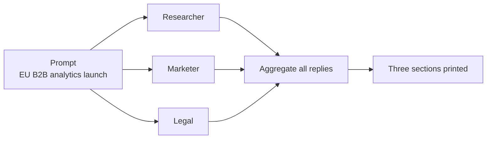

---
{
  "title": "Parallelization",
  "summary": "Fan one prompt out to several specialists at once, then collect all their answers.",
  "category": "Multi-agent",
  "projects": [
    { "flavor": "AgentFramework", "path": "Parallelization.AgentFramework" },
    { "flavor": "SemanticKernel", "path": "Parallelization.SemanticKernel" }
  ]
}
---

## What it is

When several perspectives on the *same* question are independent of one another, there is no
reason to ask for them in sequence. Parallelization — also called fan-out/fan-in — sends one
input to N agents concurrently and aggregates the replies once they are all back. Wall-clock
cost is the slowest agent, not the sum of all of them.

The important word is **independent**. No agent here reads another's answer; each sees only the
original prompt and its own instructions. That is what makes concurrency safe.

## When to use it

- Multiple angles on one input: research, marketing, legal, security, accessibility.
- Latency matters and the sub-tasks do not depend on each other.
- You want to compare or vote across answers rather than merge them mid-flight.

Skip it when step two needs step one's output — that is **PromptChaining**, and running it in
parallel just produces confident nonsense. Also skip it when the agents would mostly repeat
each other; N near-identical answers cost N times as much and tell you nothing new.

## How the demo works

Both samples create three agents — a researcher (facts, risks, unknowns), a marketer
(positioning, messaging, personas), and a legal/compliance reviewer (constraints, disclaimers)
— and give all three the identical prompt: *"Assess launching a new B2B analytics product in
the EU. Provide recommendations."* The three answers are printed side by side under `##`
headings.

The difference is who owns the concurrency. Agent Framework has it built in:
`AgentWorkflowBuilder.BuildConcurrent` wires the fan-out and a default aggregator that collects
every reply into one `List<ChatMessage>`. Semantic Kernel has no such helper in this sample, so
the concurrency is plain .NET — three `RunAgentAsync` calls started together and awaited with
`Task.WhenAll`.

## Key APIs

| Agent Framework | Semantic Kernel |
|---|---|
| `AgentWorkflowBuilder.BuildConcurrent([a, b, c])` | `Task.WhenAll(tasks)` over `agent.InvokeAsync` |
| `InProcessExecution.RunStreamingAsync(workflow, message)` | `await foreach (ChatMessageContent r in agent.InvokeAsync(...))` |
| `TurnToken(emitEvents: false)` | manual string aggregation per agent |
| `WorkflowOutputEvent { Data: List<ChatMessage> }` | `string.Join` over the completed tasks |

## What to watch in the output

Agent Framework prints one block per agent as `##researcher:`, `##marketer:`, `##legal:` —
lowercase, because those are the agent names in the source. Semantic Kernel prints `## Researcher`,
`## Marketer`, `## Legal` separated by `---` rules. In both, the ordering is the aggregator's,
not the completion order, so it looks sequential even though it was not. Compare with **Voting**,
which fans out the same question to reduce variance, and **MultiAgentCollaboration**, where the
agents do read each other.
