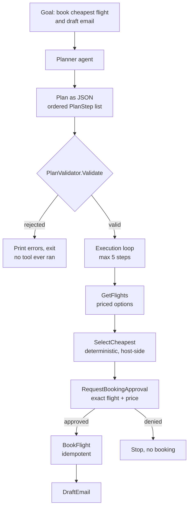

---
{
  "title": "Planning",
  "summary": "Have the model write an ordered plan of tool calls first, then validate it and execute it in your own code.",
  "category": "Orchestration",
  "projects": [
    { "flavor": "AgentFramework", "path": "Planning.AgentFramework" },
    { "flavor": "SemanticKernel", "path": "Planning.SemanticKernel" }
  ]
}
---

## What it is

In plain **ToolUse** the model decides one call at a time and you find out what it wanted only
after it happened. Planning splits that in two: first the model emits a complete, ordered plan
as structured data; then your code executes that plan step by step.

The payoff is the gap between the two phases. A plan is just JSON, so you can print it, validate
the tool names against an allow-list, cap the number of steps, show it to a human, or refuse it
outright — all before a single side effect fires.

## Information-theoretic view

A typed plan is hard information: a `PlanStep` record with a tool name and arguments either
matches the allow-list or it does not, survives any number of handlings unchanged, and can be
checked by code that cannot be persuaded (see `docs/coordination-physics.md`). Prose intent has
none of these properties — it degrades with every re-reading and every check against it is a
judgment call. The type system is the contract that makes the plan mechanically checkable: the
`PlanValidator.Validate` gate is compiler-grade evidence standing between the model's intent and
the world's side effects, which is exactly where a hard gate earns the most. The demo's discipline
of *describe, don't call* is what creates the seam the gate lives in.

## When to use it

- The goal needs several dependent calls and you want the whole shape visible up front.
- Steps have real side effects (bookings, payments) and must be reviewed before execution.
- You need an audit trail of *intent* separate from the record of what ran.

Skip it for one or two tool calls — the extra planning round trip costs more than it saves. Skip
it too when the right next step genuinely depends on what the last one returned; that is
**ReasoningAndActing**, where the model re-decides after every observation.

## How the demo works

Both samples give the planner exactly five fake travel tools — `GetFlights(from,to,date)`,
`SelectCheapest(flights)`, `RequestBookingApproval(flight)`, `BookFlight(approvedFlight)` and
`DraftEmail(confirmation)` — and one goal: book the *cheapest* flight and draft a confirmation
email, for a date computed 30 days out so it never goes stale. `GetFlights` now returns priced
`FlightOption` records, so "cheapest" is answerable from evidence instead of guessed from free
text. The planner is told to use as few steps as possible, max five, to never invent a tool name,
to make later steps depend only on earlier outputs, and that `SelectCheapest` — not the model — is
the only way to choose a flight. It returns a `Plan` of `PlanStep` records (`id`, `tool`, `args`,
`description`).

Neither flavor lets the plan touch a tool unchecked. `PlanValidator.Validate` runs first and
rejects the whole plan — before any step executes — if it is empty, too long, has duplicate step
IDs, names a tool outside the allow-list, or references a step that does not precede it.
`PlanValidator.Resolve` then substitutes `{{stepN}}` placeholders from a `memory` dictionary of
prior outputs and throws if any placeholder survives unresolved, so a tool never receives a
literal `{{stepN}}` string. A denied approval or an unresolved placeholder raises
`InvalidOperationException`, which the execution loop catches to stop the plan and print a message
instead of crashing.

The loop, not the model, drives execution. Agent Framework looks each `step.Tool` up in a
`Dictionary<string, AIFunction>`, and the Semantic Kernel sample invokes each step by name through
the imported `TravelTools` plugin — both now resolve `{{stepN}}` placeholders the same way before
invoking a tool.

## Controls this sample composes

Fixing the goal meant composing controls that live as their own patterns elsewhere, rather than
inventing new ones:

- **BoundedExecution** — the plan is capped at 5 steps and rejected outright if it is longer.
- Deterministic selection — `SelectCheapest` is a host function, not a model guess, so "cheapest"
  is decided by comparing prices, not by parsing free text.
- **HumanInTheLoop** — `RequestBookingApproval` shows the human the exact flight ID and price
  before `BookFlight` can run; the approval is bound to that evidence, not to "a booking".
- **IdempotentToolCalls** — `BookFlight` mints one booking key per plan run and replays the first
  result on a retry instead of booking twice.
- **ToolAuthorization** — `PlanValidator.Validate` is the allow-list gate: an unknown tool name
  never reaches `InvokeAsync`.

The in-memory `bookings` dictionary is a stand-in for a real idempotent booking service, not a
durable one — it lives only for the process's lifetime and is marked `// ponytail:` in the source
with the upgrade path (durable keyed storage, as in **IdempotentToolCalls**) named explicitly.

## Key APIs

| Agent Framework | Semantic Kernel |
|---|---|
| `planner.RunAsync<Plan>(goal, session)` | `ResponseFormat = typeof(Plan)` on `OpenAIPromptExecutionSettings` |
| `AIFunctionFactory.Create(GetFlights, "GetFlights")` | `kernel.ImportPluginFromType<TravelTools>()` |
| `PlanValidator.Validate(plan, allowedTools, maxSteps: 5)` | `PlanValidator.Validate(plan, allowedTools, maxSteps: 5)` |
| `PlanValidator.Resolve(step.Args, memory)` | `PlanValidator.Resolve(step.Args, memory)` |
| `tool.InvokeAsync(new AIFunctionArguments(...))` | `kernel.InvokeAsync(pluginName, step.Tool, args)` |

Neither sample enables automatic function calling on the planner — it must *describe* the calls,
not make them. That separation is the pattern. `PlanValidator` is duplicated verbatim between the
two flavors rather than shared, matching the repository's rule that samples do not share code.

## What to watch in the output

Both print `=== Plan ===` followed by one `1. GetFlights - ...` line per step, then
`Approve booking F200 at EUR 142.50? (yes/no):` before `BookFlight` runs — type `yes` to let it
proceed, anything else (including piping EOF) denies it and the run stops cleanly with
`Plan stopped at step N (...): Booking was not approved`. Watch the priced payload flow through:
the cheapest of the three fake options should be the one that ends up in `[Booked] ...` and then in
the drafted email. Feed the planner a mangled goal or lower `maxSteps` to see
`Plan rejected before any tool ran:` fire instead — no tool call happens after that line. Compare
with **ToolUse** for the single-call baseline and **HumanInTheLoop** for gating risky steps once
you can see them coming.
