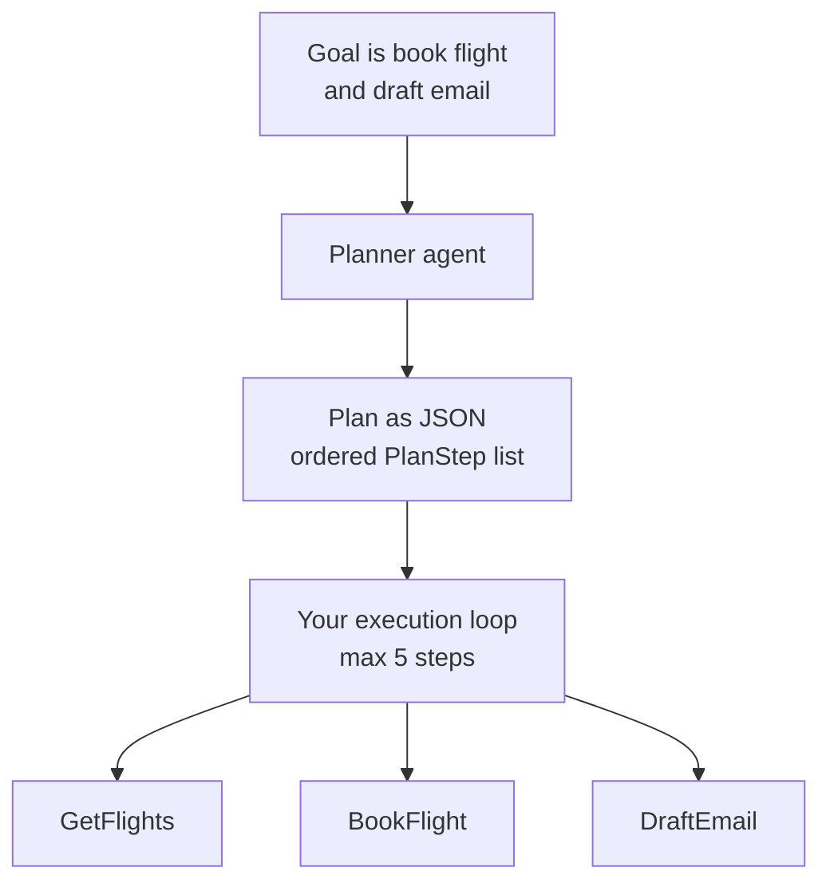

---
{
  "title": "Planning",
  "summary": "Have the model write an ordered plan of tool calls first, then execute it in your own code.",
  "category": "Orchestration",
  "projects": [
    { "flavor": "AgentFramework", "path": "Planning.AgentFramework" },
    { "flavor": "SemanticKernel", "path": "Planning.SemanticKernel" }
  ]
}
---

## What it is

In plain **ToolUse** the model decides one call at a time and you find out what it wanted only
after it happened. Planning splits that in two: first the model emits a complete, ordered plan
as structured data; then your code executes that plan step by step.

The payoff is the gap between the two phases. A plan is just JSON, so you can print it, validate
the tool names against an allow-list, cap the number of steps, show it to a human, or refuse it
outright — all before a single side effect fires.

## When to use it

- The goal needs several dependent calls and you want the whole shape visible up front.
- Steps have real side effects (bookings, payments) and must be reviewed before execution.
- You need an audit trail of *intent* separate from the record of what ran.

Skip it for one or two tool calls — the extra planning round trip costs more than it saves. Skip
it too when the right next step genuinely depends on what the last one returned; that is
**ReasoningAndActing**, where the model re-decides after every observation.

## How the demo works

Both samples give the planner exactly three fake travel tools — `GetFlights(from,to,date)`,
`BookFlight(flightId)` and `DraftEmail(confirmation)` — and one goal: book a flight and draft a
confirmation email. The planner is told to use as few steps as possible, max five, to never
invent a tool name, and to make later steps depend only on earlier outputs. It returns a `Plan`
of `PlanStep` records (`id`, `tool`, `args`, `description`).

The loop, not the model, drives execution. Agent Framework looks each `step.Tool` up in a
`Dictionary<string, AIFunction>` and throws `Tool not allowed` on a miss — the allow-list check
the plan format makes possible. It also keeps a `memory` dictionary of step outputs and rewrites
`{{stepN}}` placeholders in the arguments with a regex, so `BookFlight` can consume what
`GetFlights` produced. The Semantic Kernel sample invokes each step by name through the imported
`TravelTools` plugin and passes the planned arguments through verbatim — no placeholder
substitution, so each step's args come straight from the plan.

## Key APIs

| Agent Framework | Semantic Kernel |
|---|---|
| `planner.RunAsync<Plan>(goal, session)` | `ResponseFormat = typeof(Plan)` on `OpenAIPromptExecutionSettings` |
| `AIFunctionFactory.Create(GetFlights, "GetFlights")` | `kernel.ImportPluginFromType<TravelTools>()` |
| `Dictionary<string, AIFunction>` as allow-list | `kernel.InvokeAsync(pluginName, step.Tool, args)` |
| `tool.InvokeAsync(new AIFunctionArguments(...))` | `KernelArguments` per step |

Neither sample enables automatic function calling on the planner — it must *describe* the calls,
not make them. That separation is the pattern.

## What to watch in the output

Both print `=== Plan ===` followed by one `1. GetFlights - ...` line per step, then execute and
print `[Step N] <tool> output:` for each — the Semantic Kernel run adds an `=== Execution ===`
header, the Agent Framework run ends with `=== Done ===`. Watch the fake payloads flow through:
`F100 09:00` from `GetFlights` should end up inside the `confirmation: ABC123` line and then in
the drafted email. Compare with **ToolUse** for the single-call baseline and **HumanInTheLoop**
for gating the risky steps once you can see them coming.
