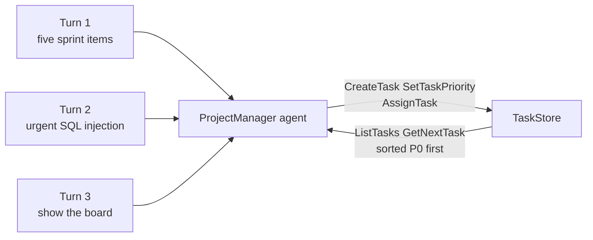

---
{
  "title": "Prioritization",
  "summary": "Give the agent ranking criteria and a task store, then let it re-rank the queue when urgency changes.",
  "category": "Learning & goals",
  "projects": [
    { "flavor": "AgentFramework", "path": "Prioritization.AgentFramework" },
    { "flavor": "SemanticKernel", "path": "Prioritization.SemanticKernel" }
  ]
}
---

## What it is

An agent facing a queue of work has to decide what comes first. Prioritization makes that
decision explicit: the system prompt carries the ranking rubric (here P0 critical, P1 important,
P2 normal, each with concrete examples), and the ordering itself lives in a real store the agent
mutates through tools — create, set priority, assign, list, get next.

The interesting half is *re*-prioritization. When something urgent arrives mid-run, the agent
does not just append it; the prompt instructs it to re-evaluate every existing task, because a
new P0 can push yesterday's P0 down. State lives in the store, so the ranking survives across
turns and the agent can always read back the current board.

## When to use it

- More work than capacity, and the ordering has real consequences — incidents, support queues,
  build pipelines, agent task backlogs.
- The criteria are expressible in words but the judgement per item is fuzzy ("is a 500 on
  checkout worse than a security bug?").
- New information arrives during the run and should shake up the existing order.

Skip it when a `OrderBy` on a numeric field does the job — a fixed SLA, a due date, a severity
column already in your database. Paying for a model to sort things you can sort deterministically
is the classic over-use of this pattern.

## How the demo works

Both samples run a `ProjectManager` agent over three turns on one shared conversation. Turn 1
hands it five sprint items (dark mode, login timeout bug, API docs, checkout 500s, CI/CD
migration) to create, prioritize and assign to Alice, Bob or Carol. Turn 2 drops a SQL injection
vulnerability on it and demands a full re-evaluation. Turn 3 just asks for the board.

`TaskStore` is a `ConcurrentDictionary` handing out ids like `TASK-001`; every new task starts
at `P2` and only becomes P0 or P1 because the agent calls `SetTaskPriority`. `GetAllSorted`
orders by the priority string then by creation time, so P0 comes first and ties break oldest-first.

## Key APIs

| Agent Framework | Semantic Kernel |
|---|---|
| Local functions + `AIFunctionFactory.Create(CreateTask)` | `ProjectTools` class with `[KernelFunction]` + `[Description]` |
| `new ChatClientAgent(client, name: "ProjectManager", instructions, tools: [...])` | `new ChatCompletionAgent { Name = "ProjectManager", Instructions = ..., Kernel = kernel }` |
| `await agent.CreateSessionAsync()` passed to each `RunAsync` | `new ChatHistoryAgentThread()` passed to each `InvokeAsync` |
| Instance `TaskStore` captured by the local functions | `static TaskStore` used by the static plugin methods |
| `await agent.RunAsync(prompt, session)` | `await foreach (var r in agent.InvokeAsync(prompt, thread))` |

The shared session/thread is what makes turn 2 work — without it the agent would not remember
`TASK-001` through `TASK-005` and could not re-rank them.

## What to watch in the output

Three banners split the run: `---- Step 1: Initial task batch ----`, `---- Step 2: Urgent issue
arrives — re-prioritize ----`, `---- Step 3: Final task board ----`. The tools themselves return
readable strings, so you can trace `Created TASK-001: '…' (priority: P2)`, `Set TASK-004 priority
to P0.` and `Assigned TASK-004 to Carol.` in the agent's narration. The tell that
re-prioritization really happened is in step 3's `ListTasks` output — the SQL injection task
appears as `[P0]` above the checkout outage, and the earlier P0 has usually been rewritten. See
**ToolUse** for the underlying call mechanism and **Planning** for deciding *what* the tasks
should be rather than in which order to do them.
