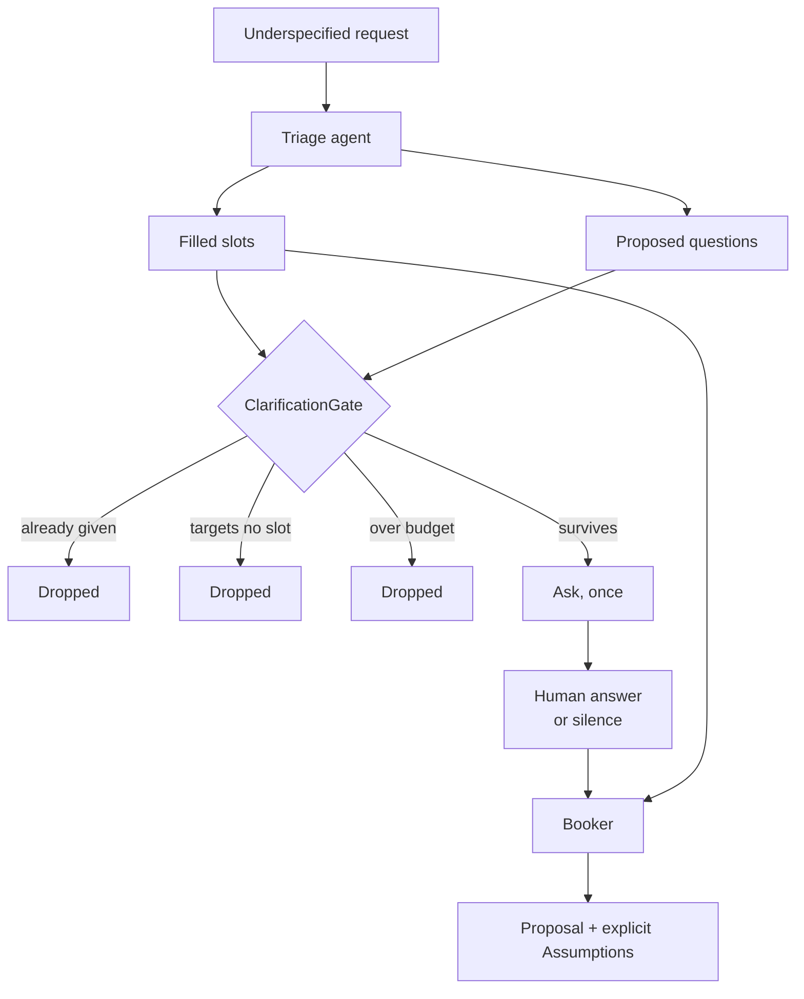

---
{
  "title": "Proactive Clarification",
  "summary": "Ask before acting — once, only about what the request left out, and never more than the host allows.",
  "category": "Reasoning & generation",
  "projects": [
    { "flavor": "AgentFramework", "path": "ProactiveClarification.AgentFramework", "interactive": true }
  ]
}
---

## What it is

An agent given an underspecified request has three options, and two of them are bad. It can
guess silently, and be confidently wrong in a way nobody notices until the booking is made. It
can refuse until every field is supplied, which is a form. Or it can ask — which is right, and
which is also how agents turn into interrogations.

The pattern is not "let the model ask questions". Models are perfectly willing to ask questions;
left alone they ask five, including two about things the request already said. The pattern is
the two limits the host puts around that: a **screen** that discards questions the request
already answered, and a **single round**, after which anything still missing becomes a stated
assumption rather than another question.

The second limit is the one people leave out, and it is the one that matters. An agent that
never starts is a worse failure than an agent that assumed a checkout time — the assumption is
visible and correctable; the endless clarification loop just looks like the product not working.

## When to use it

- Requests that trigger side effects with parameters — bookings, purchases, filings, messages.
  Getting a parameter wrong costs more than one question.
- Where a wrong assumption is expensive but a stated assumption is cheap. Saying "I assumed
  three nights" gives the user an obvious place to object.
- As the front door to **Planning** or **StateMachineAgent**: gather the slots, then run the
  machine that needs them filled.

Skip it when the action is trivially reversible — just do the thing and let the user correct it,
which costs one turn instead of two. Skip it too when the request is a question rather than an
instruction: **HumanInTheLoop** guards the side effect at the point of execution, which is a
better place to spend a human's attention than the parameter-gathering phase.

## How the demo works

`"Book me a room next week, somewhere warm, and not too expensive."` — three fragments that feel
like information and pin down nothing. The host requires four slots: `destination`, `checkIn`,
`nights`, `budget`.

A triage agent reports which slots the request genuinely fills and proposes one question per gap.
Its instructions are explicit that *"somewhere warm"* is not a destination and *"next week"* is
not a date, because a model reading generously will otherwise mark both as filled and ask about
neither.

Then `ClarificationGate.Screen` — the host's part. Each proposed question is matched against a
keyword vocabulary that lives **in the host, not in the prompt**, and is rejected if it targets a
slot already filled, targets no slot at all (*"could you tell me more?"* — a free round trip that
returns nothing), duplicates an earlier question, or exceeds the three-question budget. The
vocabulary lives host-side because that is what makes the rule checkable: the model proposes,
the host decides which questions are worth a human's attention.

Whatever survives is asked once, in a single prompt. The answer — or `Enter`, or EOF when the
sample runs non-interactively — closes the round. Slots still unknown after that are handed to
the booking agent as *"still unknown"*, with instructions to choose a default and list it under
`Assumptions:` in the form `slot = value (assumed)`. It is told, in as many words, that the
clarification round is over.

## Key APIs

- `agent.RunAsync<Triage>(...)` — structured output splits "what the request said" from "what I
  want to ask", so the host can screen the second against the first.
- `ClarificationGate.Screen(slots, filled, questions, maxQuestions)` — returns every question
  with a rejection reason or `null`, so the run can print what it chose not to ask. Deciding by
  *slot* rather than by question text is what makes "one question per slot" enforceable.
- `Console.ReadLine()` — a single blocking read for the single round. `null` at EOF means the
  sample degrades to assumptions rather than hanging, which is why it runs unattended in Pattern
  Explorer.

## What to watch in the output

The triage block prints `filled: slot = value` for each slot the model thought was pinned down —
worth checking against the request, because this is where over-generous reading shows up. On the
default request a well-behaved triage pins down *nothing*, and the block says so. Then
the screen: `ask:` lines are what reaches the human, `dropped:` lines carry the reason. A
`dropped: ... (asks about no required slot)` is the model reaching for a conversational filler
question; `('destination' was already given)` is it asking about something it just marked filled.

If you answer the prompt, watch how the answer flows into the proposal. If you press Enter, watch
the `Assumptions:` block instead — every unknown slot appears there with `(assumed)`. That block
is the pattern's real output: the agent proceeded, and said exactly what it made up.

**HumanInTheLoop** approves an action about to happen; this fills in the parameters before one is
planned. **BoundedExecution** is the same instinct applied to the run as a whole — a limit the
host owns, not a request the prompt makes.
