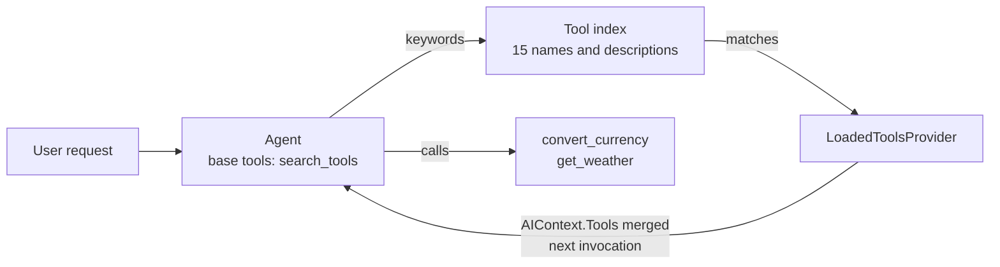

---
{
  "title": "Progressive Tool Disclosure",
  "summary": "Start with a search tool over the catalog; bind real tool definitions only when a request needs them.",
  "category": "Knowledge & state",
  "projects": [ { "flavor": "AgentFramework", "path": "ProgressiveToolDisclosure.AgentFramework" } ]
}
---

## What it is

Every bound tool costs context on **every** call — name, description, JSON schema —
whether or not the request needs it. An agent wired to a few MCP servers easily carries
dozens of definitions per request, most of them dead weight that also degrades tool
selection. Progressive disclosure keeps the catalog *outside* the context: the agent
starts with a single `search_tools` meta-tool over an index of names and descriptions,
and matching tools are bound on demand for the turns that follow.

The same idea powers skills systems, where only YAML frontmatter is loaded up front and
the body is read on demand — **SkillLearning** shows that variant.

## When to use it

- Large tool catalogs (many MCP servers, plugin ecosystems) where any single request
  touches a handful of tools at most.
- Tool definitions with big schemas — the savings scale with definition size.
- Tool-selection accuracy drops because the model faces a wall of similar definitions.

Skip it below roughly a dozen tools — an extra discovery turn buys nothing there. And
keep the index searchable: disclosure only works if the agent can *find* the tool from
the user's phrasing.

## How the demo works

A 15-tool catalog (weather, currency, stocks, trains, parcels, …) exists only as an
in-memory index. The agent's base tools contain exactly one entry: `search_tools`, which
keyword-matches the index and adds hits to a `LoadedToolsProvider`. That provider is an
`AIContextProvider` whose `AIContext.Tools` is merged into the agent's tool list on
every invocation — so the model's tool list is always *search_tools + whatever has been
discovered so far*. Newly loaded tools become callable on the **next** turn, because
context providers run once per invocation.

A `ToolCountMeter` (delegating `IChatClient`) records how many tool definitions each
model call actually carried.

## Key APIs

- `AIContextProvider.ProvideAIContextAsync(...)` returning `new AIContext { Tools = [...] }` —
  per-invocation tool binding; the framework merges it with `ChatOptions.Tools`.
- `AIContextProviders = [provider]` on `ChatClientAgentOptions`.
- `AIFunctionFactory.Create(lambda, "search_tools", description)` — the one always-bound
  meta-tool, closing over the provider so a search can bind its own results.

## What to watch in the output

Turn one — *"How many DKK is 250 EUR, and will it rain in Copenhagen tomorrow?"* — is
answered with `[tool definitions sent to the model: 1 of 16 available]`: the model saw
only `search_tools`, used it, and confirmed what it loaded. Turn two shows `3 of 16` —
search_tools plus the two discovered tools — and the actual answers. The closing line
names what was loaded on demand and notes that the other 13 definitions never entered
the context. **MCP** is a related contrast case: it still sends every *bound* tool's
definition on every call rather than searching on demand, though it narrows which
discovered tools get bound at all with an explicit allowlist. **SkillLearning** applies
the same frontmatter-first trick to learned procedures.
