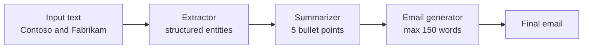

---
{
  "title": "Prompt Chaining",
  "summary": "Split one hard request into ordered steps, each feeding its output into the next.",
  "category": "Fundamentals",
  "projects": [
    { "flavor": "AgentFramework", "path": "PromptChaining.AgentFramework" },
    { "flavor": "SemanticKernel", "path": "PromptChaining.SemanticKernel" }
  ]
}
---

## What it is

One prompt that asks for everything at once gets a mediocre answer to everything at once.
Prompt chaining breaks the job into a fixed sequence of narrow steps and wires the output of
each into the input of the next. Every step gets its own instructions, its own model call, and
a much smaller problem to get right.

The sequence is decided by *you*, not the model — that is the whole point. Nothing is dynamic,
so the shape of the run is known before it starts and each hop is separately inspectable.

## When to use it

- The task has a natural pipeline: extract, then summarize, then draft.
- A later step needs the earlier step's result *as data*, not as vibes — structured output at
  step 1 makes step 2 concrete.
- You want to swap a model, tighten a prompt, or add a validation gate at one stage only.

Skip it when the steps are independent — run them at once and use **Parallelization**. Skip it
too when the order genuinely depends on the input; that is **Routing** or **Planning**, not a
fixed chain.

## How the demo works

Both samples take the same paragraph about Contoso considering an acquisition of Fabrikam and
run three steps: extract entities as structured JSON, summarize the original text in five
bullets while explicitly naming those entities, then draft a leadership email of 150 words or
fewer from that summary.

The chain is identical; only the plumbing differs. Agent Framework builds a real graph —
`ExtractorExecutor`, `SummarizerExecutor` and `EmailExecutor` are `Executor` subclasses joined
by `WorkflowBuilder.AddEdge`, passing typed messages: an `InputWithText` record carries the
`ExtractedEntities` plus the original text down to the summarizer. Semantic Kernel keeps it as
three plain awaited calls in `Program.cs`, each an `InvokePromptAsync` with a
`{{$placeholder}}` template.

## Key APIs

| Agent Framework | Semantic Kernel |
|---|---|
| `new WorkflowBuilder(first).AddEdge(a, b)` | three sequential `await` calls |
| `Executor` subclass with `[MessageHandler]` | `kernel.InvokePromptAsync(template, args)` |
| `agent.RunAsync<ExtractedEntities>(input)` | `OpenAIPromptExecutionSettings.ResponseFormat = typeof(T)` |
| `context.SendMessageAsync` / `YieldOutputAsync` | `KernelArguments["text"] = ...` |
| `InProcessExecution.RunStreamingAsync` | plain `Console.WriteLine` per stage |

Both flavors force step 1 to return typed JSON rather than prose — that contract is what makes
the hand-off to step 2 reliable.

## What to watch in the output

The Semantic Kernel run prints each stage under `=== Entities ===`, `=== Summary ===` and
`=== Email ===`, so you can read the hand-offs directly. The Agent Framework run only prints
the final `WorkflowOutputEvent`, i.e. the email — the intermediate messages stay inside the
workflow. Look for Alice, Contoso and Fabrikam surviving all three hops. Compare with
**Routing**, which picks one branch instead of running a fixed line, and with
**Parallelization** for the fan-out version.
