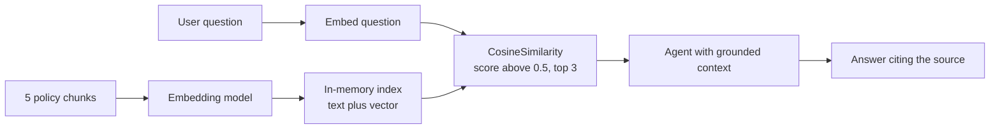

---
{
  "title": "Retrieval-Augmented Generation",
  "summary": "Embed your documents, retrieve the closest chunks, and let the model answer from them.",
  "category": "Knowledge & state",
  "projects": [
    { "flavor": "AgentFramework", "path": "RAG.AgentFramework" },
    { "flavor": "SemanticKernel", "path": "RAG.SemanticKernel" }
  ]
}
---

## What it is

A model only knows what was in its training data. Retrieval-Augmented Generation closes that
gap without fine-tuning: you split your documents into chunks, turn each chunk into an
embedding vector, and at question time embed the question too. The chunks whose vectors sit
closest to the question go into the prompt as context, and the model answers from them.

The loop is **embed corpus once → embed question → rank by similarity → stuff the top hits
into the prompt → answer with citations**. Grounding is the point: the model quotes your
policy document instead of inventing one.

## When to use it

- The answer lives in documents the model never saw: internal policies, manuals, tickets.
- The corpus changes often enough that retraining or fine-tuning is not worth it.
- You need citations, so a reviewer can check where an answer came from.

Skip it when the corpus is small enough to paste into the system prompt outright, or when the
question needs reasoning over *all* documents rather than the few that look similar —
similarity search returns neighbours, not completeness.

## How the demo works

Both samples index the same five HR policy chunks (remote work, PTO, parental leave, expenses),
then ask three questions: *"How many days can I work from home per week?"*, *"What's the
parental leave policy for adoptions?"* and *"Can I fly business class on a 4-hour flight?"*.
The instructions tell the agent to answer only from the retrieved context and to cite the
source document.

Both flavors deliberately keep the index as a plain `List` scored with
`TensorPrimitives.CosineSimilarity` rather than a vector-store connector. That is a conscious
design note, not an oversight: the InMemory connector
(`Microsoft.SemanticKernel.Connectors.InMemory` 1.74.0-preview) is runtime-incompatible with
the `Microsoft.Extensions.VectorData` 10.x that this package graph resolves to, and five chunks
do not need a database anyway. Everything else about the pattern is unchanged — swap the loop
for a real store when the corpus grows.

The wiring differs: Agent Framework retrieves *before* every model call, Semantic Kernel lets
the model call retrieval as a function.

## Key APIs

| Agent Framework | Semantic Kernel |
|---|---|
| `TextSearchProvider(SearchPoliciesAsync, options)` | `kernel.Plugins.AddFromFunctions("Policies", ...)` |
| `agent.AsBuilder().UseAIContextProviders(...)` | `KernelFunctionFactory.CreateFromMethod(..., "SearchPolicies", ...)` |
| `TextSearchBehavior.BeforeAIInvoke` | `FunctionChoiceBehavior.Auto()` |
| `AsIEmbeddingGenerator()` on the Azure embedding client | `IEmbeddingGenerator<string, Embedding<float>>` from the kernel |

## What to watch in the output

Each run starts with `Indexed 5 policy documents.` (or `Indexed 5 policy chunks.` in the
Semantic Kernel flavor), then prints `User:` / `Agent:` pairs. The tell that retrieval worked
is the citation — the answers name the policy document, and the flight question is answered
with the 6-hour economy rule that only the expense chunk contains. **AgenticRAG** turns
retrieval into a tool the agent decides to call and grades the results; **ToolUse** covers the
function-calling mechanism the Semantic Kernel flavor relies on.
