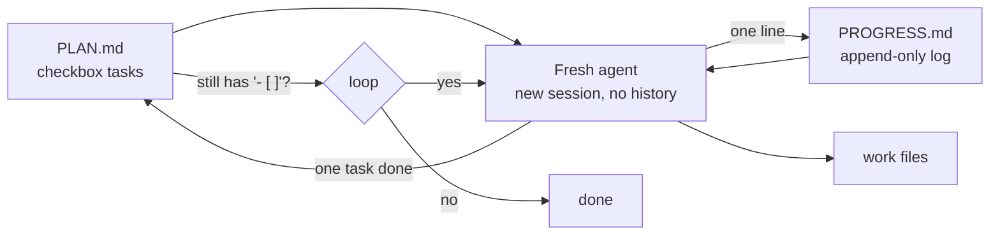

---
{
  "title": "Ralph Loop",
  "summary": "Run a fresh-context agent in a loop until the plan file is satisfied; all state lives in files.",
  "category": "Orchestration",
  "projects": [ { "flavor": "AgentFramework", "path": "RalphLoop.AgentFramework" } ]
}
---

## What it is

Most retry patterns accumulate: each attempt appends to a growing conversation until the
window fills with stale history. The Ralph loop discards the conversation instead. An
outer loop runs an agent with a **completely fresh context every iteration**; the only
things that survive are files — a plan (`PLAN.md`) that doubles as the loop's exit
condition, an append-only progress log the iterations use to talk to each other, and the
work products themselves. The original pattern communicates progress through git
history; this demo uses `PROGRESS.md` in the same role.

Fresh context is the feature, not a limitation: every iteration re-reads the *current*
state of the world rather than its own possibly-stale memory of it, and context size
stays flat no matter how long the loop runs.

## When to use it

- Long-horizon work that outlives any single context window (large migrations,
  multi-file builds, overnight runs).
- Tasks with a checkable definition of done — a task list, a failing test suite — so
  the loop, not the model, decides when to stop.
- You want crash tolerance for free: state on disk means any iteration can die and the
  next one picks up where the plan says.

Skip it for short interactive tasks — re-reading the plan every iteration costs more
than it saves, and **Reflexion** (retries within one context, carrying reflections) is
the better fit when the task fits in a window.

## How the demo works

The host seeds a workdir with a three-task `PLAN.md` (research, itinerary, summary for a
Copenhagen travel guide — later tasks depend on earlier files) and an empty
`PROGRESS.md`. Then it loops up to eight times; each iteration calls
`agent.CreateSessionAsync()` — a brand-new session, zero carried history — with
instructions to read the plan and progress log, complete exactly **one** unchecked task
with `list_files`/`read_file`/`write_file`, tick the checkbox, and append one progress
line. The host breaks as soon as `PLAN.md` contains no `- [ ]`.

## Key APIs

- `agent.CreateSessionAsync()` per iteration — the fresh context IS the pattern; the
  agent object itself is stateless.
- Plain file tools via `AIFunctionFactory.Create(...)`, path-restricted to the workdir.
- The exit condition is host code reading `PLAN.md` — the loop never asks the model
  whether it is done.

## What to watch in the output

One line per iteration: `DONE: <task>  [N tool calls, context discarded]` — typically
three iterations, a handful of tool calls each, never growing, because no iteration
drags the previous ones' transcripts along. Then the final `PLAN.md` (all boxes
ticked), the progress log — three one-liners that were the *entire* inter-iteration
communication — and the produced files, where `itinerary.md` demonstrably uses the
sights from `research.md` written by an earlier, forgotten context. **Reflexion** is
the in-context cousin; **DurableExecution** checkpoints and resumes one workflow rather
than restarting cheap fresh ones; **ContextOffloading** shares the files-over-context
philosophy for a single session.
