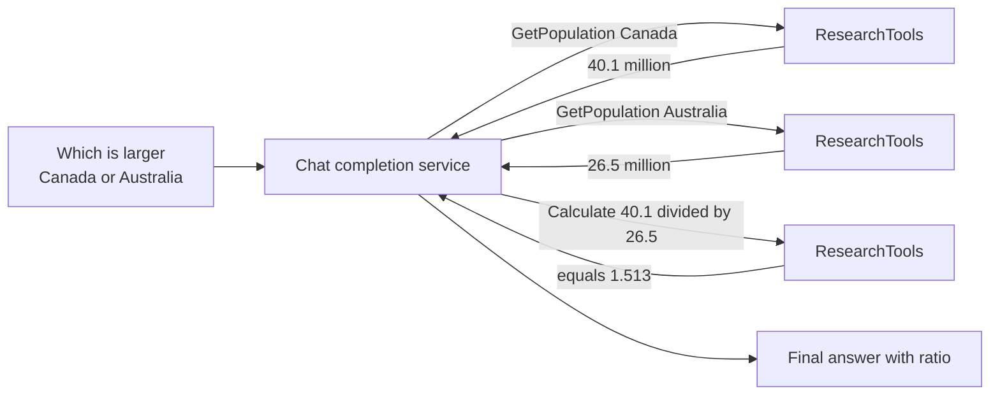

---
{
  "title": "Reasoning and Acting",
  "summary": "Interleave thinking with tool calls so each fact the model gathers informs the next step.",
  "category": "Reasoning & generation",
  "projects": [ { "flavor": "SemanticKernel", "path": "ReasoningAndActing" } ]
}
---

## What it is

ReAct interleaves two things that usually happen separately: **reasoning** about what you still
need to know, and **acting** to find out. The model thinks, calls a tool, reads the result,
thinks again with that result in hand, and repeats until it can answer. Neither half works alone —
reasoning without tools invents facts, tools without reasoning cannot decide which one to call
next.

Compared to plain Tool Use, the difference is the *loop* and the running commentary between
calls. Compared to Planning, the difference is that nothing is decided upfront; the next action
depends on what the last one returned.

## When to use it

- Questions that need several lookups where later lookups depend on earlier results.
- Research-shaped work: gather, compare, compute, conclude.
- Anywhere you want a traceable record of why each call was made.

Skip it when one tool call answers the question — that is Tool Use, and the extra reasoning
scaffold is just tokens. Skip it for a fixed known sequence of steps; a hard-coded chain is
cheaper and cannot wander. Always cap the loop: an unbounded ReAct agent can call tools until
your budget runs out.

## How the demo works

A local kernel is built with `Settings.CreateKernelBuilder()` so the shared `Settings.Kernel`
singleton stays untouched, then `ResearchTools` is registered as a plugin. It exposes two
`[KernelFunction]` methods: `GetPopulation(country)`, a simulated lookup returning strings like
"Approximately 40.1 million (2024 estimate)", and `Calculate(expression)`, which evaluates a math
expression with `new DataTable().Compute(...)`.

The question is *"Which country has a larger population — Canada or Australia? And what is the
approximate ratio?"* — deliberately unanswerable in one call. The agent has to look up both
countries, then divide. `FunctionChoiceBehavior.Auto()` lets it keep calling until it stops.

SK 1.79 exposes no max-auto-invoke setting on `FunctionChoiceBehavior`, so the system prompt still
carries *"Use at most 10 tool calls before giving your final answer."* — but that sentence is only
a hint the model can ignore. The actual control is `ToolCallBudgetFilter`, an
`IFunctionInvocationFilter` registered on the local kernel: it counts every tool call and throws
once the 11th would run, so the call that would exceed the budget never executes. The top-level
`try`/`catch` turns that exception into a `PARTIAL` result — the same shape **Bounded Execution**
uses for its own hard stops — instead of letting the process crash mid-answer.

## Key APIs

- `Settings.CreateKernelBuilder().Build()` — a private kernel so plugin registration is not global.
- `kernel.Plugins.AddFromType<ResearchTools>()` — registers both tools from one class.
- `[KernelFunction]` + `[Description]` on `GetPopulation` and `Calculate`.
- `new OpenAIPromptExecutionSettings { FunctionChoiceBehavior = FunctionChoiceBehavior.Auto() }`.
- `chatService.GetChatMessageContentAsync(history, settings, kernel)` — the kernel argument is what
  makes auto-invocation possible.
- `ToolCallBudgetFilter : IFunctionInvocationFilter` — the host-enforced call cap; see
  **Bounded Execution** for the fuller pattern of hard, host-enforced run limits.

## What to watch in the output

The demo prints a single block prefixed `ReAct Agent:`. The tool calls themselves are not logged,
so the tell is in the content: the answer should quote the exact simulated figures — 40.1 million
and 26.5 million — and a ratio near 1.5, none of which the model could produce without calling
the plugin. If the model instead wanders past the tool-call budget, the output switches to
`Result status: PARTIAL` with a `Stop reason:` line naming the exhausted budget — proof the bound
stopped the loop rather than the model choosing to stop. **Tool Use** is the single-call
foundation this loops over; **Middleware** shows how to log every invocation so the
reasoning-acting alternation becomes visible.
