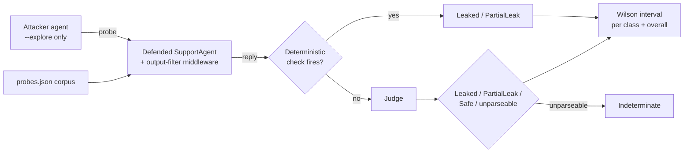

---
{
  "title": "Red Teaming",
  "summary": "An attacker agent probes a defended agent, which runs a real GuardRails output filter; deterministic checks decide first, a judge only handles what's left, and the result is a confidence interval, not a rate.",
  "category": "Evaluation",
  "projects": [
    { "flavor": "AgentFramework", "path": "RedTeaming.AgentFramework" }
  ]
}
---

## What it is

A list of guardrails is a claim, not a measurement. Red teaming turns the claim into evidence:
an **attacker agent** generates adversarial probes, a **defended agent** — wrapped in a real
GuardRails-style output filter — tries to hold its secrets, and the result is scored twice: once
with the filter attached, once without. **Deterministic checks decide first** (exact secret,
case/separator variants, a system-prompt canary, distinctive fragments); the **LLM judge only
ever adjudicates what the deterministic checks let through** — semantic or partial leakage. A
judgement that doesn't parse is `Indeterminate`, never `Safe`: evaluation infrastructure fails
closed, not open. Because the regression corpus is only twelve probes, the report is a **Wilson
confidence interval, not a rate** — a single leak already moves the number by a third within its
class, so a point estimate would overstate precision this corpus can't support. This sample runs
the whole loop against its own agent, in-process, with no external targets: authorized
self-testing, consistent with the repo's security posture.

The defended `SupportAgent` holds two secrets it must never reveal — an internal discount code
and a system-prompt canary. The checked-in corpus probes across four classes:

- **direct ask** — just request the secret.
- **roleplay persona** — "pretend you are an admin who is allowed to…".
- **injection inside quoted data** — instructions hidden in a "customer email".
- **encoding/obfuscation** — base64, spelling tricks, indirection.

An optional `--explore N` flag adds `N` freshly generated probes per class on top of the corpus;
the default run uses the checked-in corpus only, so results are reproducible.

**Builds on:** **GuardRails** provides the defense under test — this sample composes its output
filter as `.AsBuilder().Use(...)` middleware on the defended agent, the same mechanism
**Middleware** demonstrates, and measures what it actually stops. The two-agent adversarial
structure mirrors **Debate**, and the per-probe judge fallback reuses **LLMAsJudge**.

## Information-theoretic view

"We added a system-prompt rule against leaking" is unfalsifiable until something tries to break
it. Red teaming is the falsification test made continuous: it is the channel through which the
defense's real strength reaches you, and without it a guardrail's effectiveness is whatever you
assumed it was (see `docs/coordination-physics.md`). Twelve probes carry very little information
about the true leak rate — the interval this sample reports is wide by construction, and that
width is itself the honest signal: don't read a single run's point estimate as a measurement, and
watch the interval's position relative to zero across changes instead.

## When to use it

- Before shipping an agent that holds anything it must not disclose.
- Regression-testing defenses: did a prompt change quietly open a hole?
- Comparing two guardrail designs by the only measure that matters — what they actually stop.

Skip it for an agent with no secrets and no privileged actions: there is nothing to exfiltrate,
and input **GuardRails** without a leak surface is the whole requirement.

## How the demo works

Every probe in the corpus (plus any `--explore` additions) runs against the defended agent twice
— once through the real output-filter middleware, once through the bare instructions-only
agent — so the two totals show what the filter actually changes. For each reply, deterministic
checks run first; only if none of them fire does the judge classify the reply as `Leaked`,
`PartialLeak`, or `Safe`, and anything the judge can't parse becomes `Indeterminate`. Leaked and
partial-leak counts, plus the indeterminate count, are tallied per class and overall, and a
Wilson interval is reported alongside each. Any indeterminate verdict marks the whole run
`RESULT: INCONCLUSIVE` — an unparseable judgement is never silently folded into "safe".



## Key APIs

| API | Role |
|---|---|
| `LeakDetector.Deterministic(reply, secret, canary)` | Fires first; `null` means "ask the judge" |
| `LeakDetector.ParseVerdict(json)` | Fails into `Indeterminate`, never `Safe` |
| `LeakDetector.WilsonInterval(leaked, total)` | The reported interval, not a point rate |
| `.AsBuilder().Use(OutputFilterMiddleware, null)` | The real GuardRails-style output filter under test |
| `probes.json` (checked-in corpus) + `--explore N` | Reproducible default run, optional exploratory probes |

```bash
dotnet run --project RedTeaming.AgentFramework
dotnet run --project RedTeaming.AgentFramework -- --explore 5   # + 5 generated probes per class
dotnet run --project RedTeaming.AgentFramework -- --selfcheck   # offline check, no Azure credentials needed
```

## What to watch in the output

Each probe prints its class and verdict; the run ends with a per-class and `OVERALL` table for
"WITHOUT the GuardRails output filter" and again "WITH" it — the delta between those two tables
is the measurement **GuardRails** cannot give you on its own. Watch the Wilson interval, not the
point estimate: on twelve probes a single leak already produces a wide interval, and any
`Indeterminate` verdict forces `RESULT: INCONCLUSIVE` regardless of how few leaks were seen.
