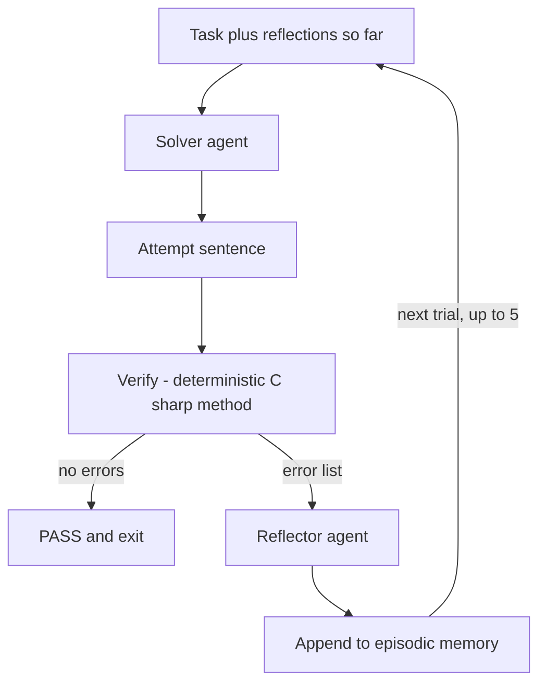

---
{
  "title": "Reflexion",
  "summary": "Fail a task, write down why in words, and retry from scratch with that reflection in memory.",
  "category": "Reasoning & generation",
  "projects": [ { "flavor": "AgentFramework", "path": "Reflexion" } ]
}
---

## What it is

Reflexion is verbal reinforcement learning across **episodes**. Attempt the task, run the attempt
through a verifier, and on failure ask the agent to write a short self-reflection: what went
wrong, what to do differently. That reflection goes into episodic memory, and the next trial
starts the task over from scratch with every accumulated reflection injected into the prompt. No
weights change — the learning lives entirely in text that carries forward.

Three siblings sit close by, and the distinction matters. **Self-Correction Loop** revises *the
same draft* within one pass using an LLM critic. **ExpeL** distills general reusable rules from
many past episodes for *future, different* tasks. Reflexion sits between them: retry loop on
**one** task, with per-trial verbal feedback, and — the key design choice in this sample — a
verifier written in **C#, not an LLM**. Failure is objective, so the trial log genuinely shows
reflections steering later attempts rather than a critic and a writer negotiating.

## When to use it

- Tasks with a programmatic pass/fail signal: tests, compilers, schema validation, constraint checks.
- Problems the model can eventually solve but rarely solves first try.
- When you want the failure reasoning visible and inspectable in plain language.

Skip it when you have no cheap ground-truth check — without a verifier this collapses back into
an LLM grading itself. Skip it when a single retry with the raw error message already fixes
things; the reflection step is only worth it if the model needs a *strategy* change, not a typo
fix. And cap the trials: each one is two model calls.

## How the demo works

The task is a hard constraint puzzle: one English sentence, exactly 6 words, every word starting
with "s", no word repeated, and each word strictly longer in letters than the one before it. Two
agents — `Solver`, told to output only the sentence, and `Reflector`, told to explain in 1-2
sentences what went wrong and what concrete strategy to try next.

Between them sits `Verify(sentence)`, an ordinary static C# method. It splits on spaces, strips
punctuation, and returns a list of concrete errors: wrong word count, a word not starting with
"s", a repeated word, or lengths that fail to strictly increase. An empty list is a pass.

Note what does and does not carry over. The attempt is thrown away each trial; only the
reflections persist, numbered and prefixed with *"Reflections from your previous failed attempts —
apply them"*. That is the entire memory mechanism — a `List<string>` and string concatenation.

## Key APIs

- Two `ChatClientAgent` instances over `Settings.ChatClient` — `Solver` and `Reflector`.
- `(await agent.RunAsync(prompt)).Text` — plain text runs; no structured output needed here.
- `static List<string> Verify(string sentence)` — a local function, the deterministic ground truth.
- `var reflections = new List<string>()` — episodic memory, injected into the next prompt.

## What to watch in the output

After the `=== Reflexion: episodic retry with self-reflection ===` banner, each trial prints
`---- Trial N ----` and three aligned lines: `Attempt:`, `Verdict:` — either `PASS` or
`FAIL — <errors>` with the verifier's exact complaints — and, on failure, `Reflection:`. The
thing to watch is whether trial N+1 actually avoids the error trial N was reflected on. It closes
with `Solved in N trial(s) with M reflection(s) in memory.` or `Gave up after 5 trials.`
**Self-Correction Loop** is the same loop with an LLM critic and in-place revision; **ExpeL**
generalises reflections into rules that outlive the task.
