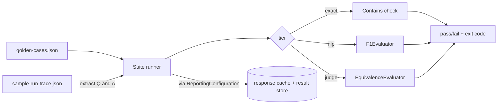

---
{
  "title": "Regression Evals",
  "summary": "A golden dataset with tiered assertions (string, NLP, judge) run as a gate, cached for CI.",
  "category": "Evaluation",
  "projects": [
    { "flavor": "AgentFramework", "path": "RegressionEvals.AgentFramework" }
  ]
}
---

## What it is

A prompt tweak that fixes one answer quietly breaks three others, and you find out in production.
Regression evals are unit tests for behavior: a checked-in **golden dataset** of cases, each with
an expected answer and an assertion, run as a suite that fails the build when quality drops. This
sample runs the suite through `Microsoft.Extensions.AI.Evaluation.Reporting`, which adds two
things a hand-rolled loop lacks — **response caching** (an unchanged case costs zero model calls
on re-run, the property that makes evals affordable in CI) and a **result store** the `aieval`
tool renders as an HTML report.

The assertions are **tiered cheapest-first**, because not every check needs a model:

- **exact** — a plain `Contains` string check. No model call.
- **nlp** — `F1Evaluator` token overlap against the golden answer. No model call.
- **judge** — `EquivalenceEvaluator`, an LLM-as-judge, for semantic equality. One model call.

**Builds on:** **EvaluationAndMonitoring** records the trajectories this pattern turns into
golden cases — one case here is extracted straight from a recorded `run-trace.json`, the
canonical *production trace → eval case* pipeline. Where **SelfCorrectionLoop** runs an evaluator
inline to fix a single answer, this runs the same class of evaluators as a pre-merge gate over
many. The judge tier is **LLMAsJudge** embedded in a suite.

## Information-theoretic view

An eval suite is a proxy for product quality, and a passing suite alongside a failing product
means the proxy has drifted (see `docs/coordination-physics.md`). The working posture is that the
suite is a hypothesis incidents revise: when a real regression ships green, the fix is a new
golden case, not a shrug. This is why the trace-sourced case matters — a captured trajectory is
ground truth about what actually happened, so growing the suite from real traces keeps the proxy
anchored to reality instead of to whatever the author imagined.

## When to use it

- You change prompts, models, or tools and need before/after evidence, not an impression.
- You run evaluation in CI and cannot pay for a live model call on every unchanged case.
- You want failures to block merges the way a red test does.

Skip the full harness for a one-off spot check — a single judged answer (see **LLMAsJudge**) is
the honest amount of machinery for a question you will not ask twice.

## How the demo works

Five golden cases live in `golden-cases.json`; a sixth is extracted at runtime from
`sample-run-trace.json` (a minimal `RunTrace` in EvaluationAndMonitoring's format) by reading its
first question and answer with `JsonDocument`. Each case runs through a `ScenarioRun` created from
a cache-enabled `DiskBasedReportingConfiguration`; the tier's assertion decides pass/fail; any
failure sets the process exit code to 1.



The `exact` and `nlp` tiers never call the model. The `judge` tier does, but its result is cached
by the reporting configuration, so a second run of an unchanged suite is free.

## Key APIs

| API | Role |
|---|---|
| `DiskBasedReportingConfiguration.Create(storageRootPath, evaluators, chatConfiguration, enableResponseCaching, executionName)` | The cached, stored eval harness |
| `reporting.CreateScenarioRunAsync(scenarioName)` | One scenario (one case) |
| `scenarioRun.EvaluateAsync(messages, response, contexts)` | Runs the evaluators, caches the result |
| `F1EvaluatorContext(groundTruth)` / `EquivalenceEvaluatorContext(groundTruth)` | The expected answer per tier |
| `dotnet tool run aieval report --path <store> --output report.html` | Renders the HTML report |

```bash
dotnet run --project RegressionEvals.AgentFramework            # run the suite (exit 1 on failure)
dotnet run --project RegressionEvals.AgentFramework            # re-run: judged case served from cache
dotnet run --project RegressionEvals.AgentFramework -- --selfcheck   # offline trace-extraction check
```

## What to watch in the output

Each case prints a `[PASS]`/`[FAIL]` line with its tier and the assertion detail, then the
answer. The summary line reports the pass count and the `aieval` command to render the report;
the process exits non-zero if anything failed — that is the CI gate. Run it twice: the second run
returns the judged case from the response cache without a model call. **EvaluationAndMonitoring**
is where the trace-sourced case comes from, and **LLMAsJudge** documents the judge tier's own
failure modes.
