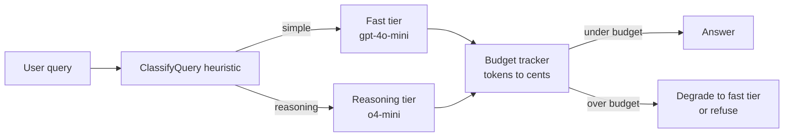

---
{
  "title": "Resource-Aware Optimization",
  "summary": "Route each query to the cheapest model that can answer it, and stop spending when the budget runs out.",
  "category": "Reliability & operations",
  "projects": [
    { "flavor": "AgentFramework", "path": "ResourceAwareOptimization.AgentFramework" },
    { "flavor": "SemanticKernel", "path": "ResourceAwareOptimization.SemanticKernel" }
  ]
}
---

## What it is

Not every question deserves the expensive model. Resource-aware optimization puts a cheap
classifier in front of several model tiers, sends each request to the smallest tier that can
handle it, and tracks what the answers cost. When the running total crosses a budget, the system
degrades deliberately — forcing the cheap tier or refusing the work — instead of silently burning
money.

Two mechanisms combine: **tiered routing** (pick a model per request, with a fallback chain if a
tier errors) and **budget enforcement** (measure token usage, convert to cents, gate on the total).

## When to use it

- Mixed traffic where most requests are trivial and a minority genuinely need a reasoning model.
- Hard cost ceilings per session, tenant, or user.
- You want graceful degradation under provider outages: fall through to the next tier instead of
  failing the request.

Skip it when all your traffic is homogeneous — one model, one price, and a router is pure
overhead. Also skip it when correctness matters more than cost; misrouting a hard question to the
fast tier produces a cheap wrong answer, which is the most expensive kind.

## How the demo works

Both flavors send the same three queries: *"What is the capital of France?"*, a long
*"Explain step by step why gradient descent converges..."* prompt, and a short greeting. A
keyword-and-word-count heuristic (`ClassifyQuery`) labels each one `simple` or `reasoning` — no
LLM call, so classification is free. `simple` routes to `gpt-4o-mini`, `reasoning` to `o4-mini`,
and each tier has a fallback chain if the call throws.

The flavors differ in where the logic lives. Agent Framework implements it as **two middleware
layers**: `RoutingMiddleware` on the `IChatClient` picks the tier and calls the chosen client
directly instead of `next`, while `BudgetEnforcementMiddleware` on the agent short-circuits the
whole run once `BudgetState.Exceeded` is true, returning a canned "I've reached my processing
budget" message. Semantic Kernel does it with **keyed services**: three chat-completion services
registered under the ids `fast`, `reasoning`, and `default`, resolved per query via
`GetRequiredKeyedService<IChatCompletionService>(sid)`, with the loop breaking out entirely once
`BudgetTracker.BudgetExceeded` flips. Its budget is a deliberately tiny 2¢ so the reasoning query
actually trips it; the Agent Framework budget is 50¢.

## Key APIs

| Agent Framework | Semantic Kernel |
|---|---|
| `chatClient.AsBuilder().Use(RoutingMiddleware, null)` | `builder.AddAzureOpenAIChatCompletion(model, ..., serviceId)` |
| `agent.AsBuilder().Use(BudgetEnforcementMiddleware, null)` | `kernel.Services.GetRequiredKeyedService<IChatCompletionService>(id)` |
| `azureClient.GetChatClient(deployment).AsIChatClient()` | `chatService.GetChatMessageContentAsync(history, settings, kernel)` |
| `response.Usage.InputTokenCount` / `OutputTokenCount` | `response.Metadata["Usage"] as ChatTokenUsage` |
| `BudgetState.RecordUsage` / `.Exceeded` | `BudgetTracker.Record` / `.BudgetExceeded` |

Both cost models are approximations hard-coded per 1K tokens: `gpt-4o-mini` 0.015¢, `gpt-4o`
0.25¢, `o4-mini` 1.10¢.

## What to watch in the output

Each query prints `[Router] Classified as: simple|reasoning`, then `[Router] Trying: <model>` and
`[Router] Success with: <model>`; a failed tier prints `[Fallback] <model> failed: ...`. Every
completed call prints a `[Budget]` line with token count, incremental cost, and the running total
against the cap, and the run ends with `Total estimated cost: N.NN¢`. Watch for
`[Router] Budget exceeded — forcing fast tier.` and `[BudgetMiddleware] Budget exceeded. Returning
early.` in the Agent Framework flavor, and `Budget limit reached. Skipping remaining queries.` in
Semantic Kernel. **Routing** shows the same classify-then-dispatch idea without the cost angle,
and **Middleware** explains the interception layers this sample builds on.
