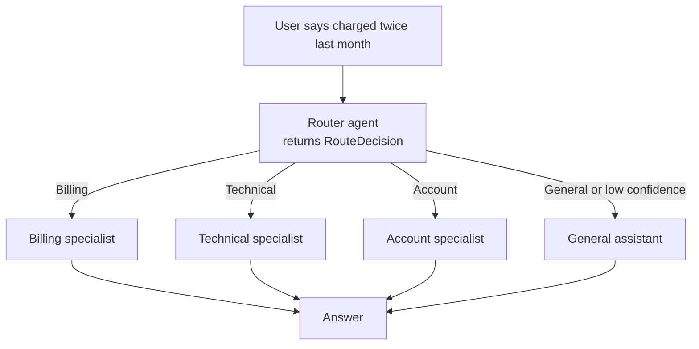

---
{
  "title": "Routing",
  "summary": "Classify the request first, then hand it to the one specialist that should answer it.",
  "category": "Orchestration",
  "projects": [
    { "flavor": "AgentFramework", "path": "Routing.AgentFramework" },
    { "flavor": "AgentFramework.Workflow", "path": "Routing.AgentFramework.Workflow" },
    { "flavor": "SemanticKernel", "path": "Routing.SemanticKernel" }
  ]
}
---

## What it is

One agent with instructions for billing *and* debugging *and* password resets is worse at all
three than three focused agents. Routing puts a cheap classifier in front: a triage step reads
the request, picks exactly one destination, and the request goes there. Each specialist keeps a
short prompt and a small toolset.

The router's job is deliberately tiny — decide, don't solve. That makes it fast, cheap, and easy
to evaluate on its own: did it pick the right lane?

## When to use it

- Requests fall into distinct categories that want different instructions, tools or models.
- You want a cheap model doing triage and an expensive one only where it earns its keep.
- Low-confidence input should be caught and clarified instead of guessed at.

Skip it when there are only two near-identical branches — a single prompt handles that more
cheaply than an extra round trip. Skip it too when the request needs *several* specialists at
once; that is **MultiAgentCollaboration** or **Handoff**.

## How the demo works

All three samples triage the same complaint about a double charge and land on billing.

- **Agent Framework** asks the router for a typed `RouteDecision` via
  `router.RunAsync<RouteDecision>(...)` — a `Route` enum, a `Reason`, and a `Confidence`. A C#
  `switch` maps the enum to one of four `ChatClientAgent` instances. If confidence is `<= 0.55`
  the sample bails out to the general agent for a single clarifying question instead of guessing.
- **AgentFramework.Workflow** models the same fan-out as a graph: `IntakeExecutor` stashes the
  `SupportRequest` in global workflow state, `RouterExecutor` emits a `RouteDecision`, and four
  conditional edges (`AddEdge<RouteDecision>(router, billing, d => d?.Route == Route.Billing)`)
  activate exactly one `SpecialistExecutor`, which reads the original request back out of state.
  `ResponseComposer` yields the final output.
- **Semantic Kernel** does it as a `HandoffOrchestration`: `OrchestrationHandoffs.StartWith`
  declares who may transfer to whom, and the LLM performs the transfer as a tool call. The
  specialists can hand *back* to `TriageAgent` if the request turns out not to be theirs.

## Key APIs

| Agent Framework | AgentFramework.Workflow | Semantic Kernel |
|---|---|---|
| `router.RunAsync<RouteDecision>(msg, session)` | `Executor<string>` / `[MessageHandler]` | `OrchestrationHandoffs.StartWith(triage)` |
| C# `switch` on the `Route` enum | `AddEdge<T>(from, to, predicate)` | `.Add(from, to, "transfer when ...")` |
| `agent.CreateSessionAsync()` | `context.QueueStateUpdateAsync("request", ..., "global")` | `HandoffOrchestration` + `InProcessRuntime` |
| confidence threshold in your own code | `ctx.ReadStateAsync<SupportRequest>` | `ResponseCallback` / `InteractiveCallback` |

Note the difference in who owns the decision: the two Agent Framework samples route in *your*
code from a typed result, while Semantic Kernel lets the model route itself by calling a
transfer function.

## What to watch in the output

The plain Agent Framework sample prints `[ROUTE] Billing (confidence=0.95)` and `[REASON] ...`
before the specialist answer — the tell that classification and answering are two separate
calls. The Workflow sample traces the graph with `Starting Intake`, `Starting Router`,
`Completed billing: ...` and finally `Workflow output: ...`; only one specialist ever starts.
The Semantic Kernel sample prints one line per turn prefixed by author name
(`TriageAgent:`, `BillingAgent:`), including the `transfer_to_BillingAgent` tool call, and ends
with `=== Final Output ===`. See **Handoff** for the transfer-driven variant taken further, and
**Planning** for when the sequence, not the branch, is what needs deciding.
