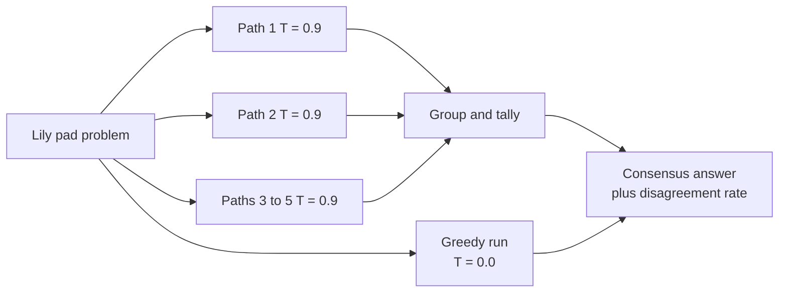

---
{
  "title": "Self-Consistency",
  "summary": "Sample one prompt several times at high temperature and majority-vote the final answers.",
  "category": "Reasoning & generation",
  "projects": [ { "flavor": "AgentFramework", "path": "SelfConsistency" } ]
}
---

## What it is

A single greedy answer follows the one path the model considered most likely — and on trap
problems that path is exactly the tempting wrong one. Self-Consistency samples the **same prompt
from the same agent N times at high temperature**, so the reasoning paths diverge, then takes
the majority answer. Wrong reasoning tends to be wrong in many different ways; correct reasoning
converges. The vote finds the convergence.

Note what it is *not*: the diversity comes from temperature, not from different personas or
different agents. That distinction separates it from **Voting**, which fields distinct agents
with distinct instructions.

## When to use it

- Problems with one objectively correct answer that the model gets right *sometimes*.
- When you want a cheap confidence signal — the disagreement rate is free evidence.
- Classification or extraction where the odd flaky output is expensive.

Skip it for open-ended writing: there is no majority to take when every sample is legitimately
different. Skip it when latency or cost matters and the greedy answer is already reliable — this
is N times the spend for one answer. And a shared systematic bias survives voting untouched; five
samples that are all wrong in the same way vote confidently for the wrong answer.

## How the demo works

One `ChatClientAgent` named `Reasoner` gets a doubling lily-pad puzzle: a patch covers a lake in
48 days, so how long to cover a lake twice as big? The tempting answer is 96; the right one is
49. The demo first fetches a baseline at `Temperature = 0.0`, then fires five independent
`RunAsync` calls at `Temperature = 0.9` concurrently via `Task.WhenAll` — the agent is stateless,
so each run is a fresh, independent path. Answers are normalised with `Trim().ToLowerInvariant()`,
grouped, and ordered by count.

Each run is typed: `RunAsync<ReasonedAnswer>` deserialises into a `record ReasonedAnswer(string
Reasoning, string FinalAnswer)`, so the vote happens on a clean field rather than on scraped prose.

## Key APIs

- `new ChatClientAgent(Settings.ChatClient, name, instructions)` — one stateless agent, reused.
- `agent.RunAsync<ReasonedAnswer>(prompt, options)` — structured output, so the answer is a field.
- `new ChatClientAgentRunOptions(new ChatOptions { Temperature = 0.9f })` — per-run sampling control.
- `Task.WhenAll(...)` over `Enumerable.Range` — the N samples run concurrently, not serially.

## What to watch in the output

Under `=== Self-Consistency Sampling ===` the demo prints `Greedy (T=0.0) answer:`, then a
`Path N:` line with reasoning for each sample, then a `Vote tally:` block and a final
`Consensus answer:` line with its disagreement rate. The last line says either "sampling agreed
with greedy this time." or "sampling + voting overturned the greedy answer." — the second is the
pattern earning its keep. **Chain of Thought** is the single path this pattern samples repeatedly;
**Voting** does the same aggregation over genuinely different agents instead of temperature.
