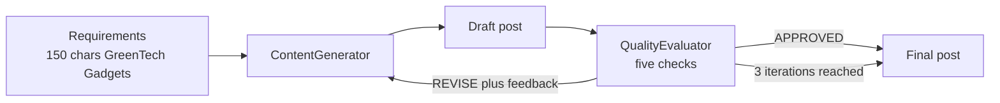

---
{
  "title": "Self-Correction Loop",
  "summary": "A generator drafts, a critic agent judges against fixed checks, and the draft is revised until approved.",
  "category": "Reasoning",
  "projects": [ { "flavor": "SemanticKernel", "path": "SelfCorrectionLoop" } ]
}
---

## What it is

Two agents with strictly separated jobs. A **generator** produces a draft. A **critic** checks it
against explicit requirements and answers with a verdict plus concrete feedback. If the verdict is
"revise", the draft and the feedback go back to the generator, and round two begins. The loop
stops on approval or on an iteration cap.

The separation is the whole trick. Asking one agent to write and grade its own work gets you
agreeable self-assessment; a critic with its own instructions — and an explicit *"never write the
post yourself, only critique"* — actually pushes back.

## When to use it

- Output with checkable requirements: length limits, required mentions, tone, format.
- First drafts that are usually close but reliably miss one constraint.
- Anywhere a human reviewer would otherwise do one quick pass and send it back.

Skip it when the requirement is mechanically checkable — a character count is `string.Length`, not
an LLM call, and code beats a critic every time (that is what **Reflexion** does). Skip it for
subjective work with no agreed standard, where the loop just churns. Always cap the iterations:
two agents can disagree forever, and each round costs two calls.

## How the demo works

`ContentGenerator` writes social media posts and is told to output only the revised post, nothing
else. `QualityEvaluator` runs a fixed five-point checklist — character limit, engagement, product
name, eco-friendliness, call to action — and must answer `APPROVED` on the first line, or `REVISE`
followed by specific feedback. The task: a post under 150 characters announcing "GreenTech
Gadgets", an eco-friendly product line.

The loop runs at most three iterations. Iteration one sends the raw requirements; every later
iteration sends requirements plus the previous draft plus the latest feedback. The exit check is
deliberately crude and worth noticing — the code splits the evaluator's reply on newline and tests
whether the first line starts with `APPROVED`, which is why the critic's instructions are so
insistent about that first line.

Both agents stream: the code accumulates chunks from `InvokeAsync` into a string before using the
reply.

## Key APIs

- `new ChatCompletionAgent { Name, Instructions, Kernel = Settings.Kernel }` — one per role.
- `await foreach (var chunk in agent.InvokeAsync(prompt))` — streaming invocation, accumulated.
- A plain `for` loop with `maxIterations = 3` — the loop is C#, not a framework construct.
- `latestFeedback.Split('\n')[0].StartsWith("APPROVED", StringComparison.OrdinalIgnoreCase)` — the
  entire termination condition.

## What to watch in the output

Each round prints `--- Iteration i/3 ---`, then a `Generator:` line with the draft and an
`Evaluator:` line with the verdict and feedback. Watch the draft change between rounds in exactly
the way the previous feedback asked — that is the pattern working. The run ends with either
`Approved after N iteration(s).` or `Max iterations reached. Using best draft.`, then
`Final post:`. **Reflexion** runs the same shape with a deterministic C# verifier instead of a
critic agent and retries from scratch rather than revising; **Evaluation and Monitoring** covers
the judging half on its own.
