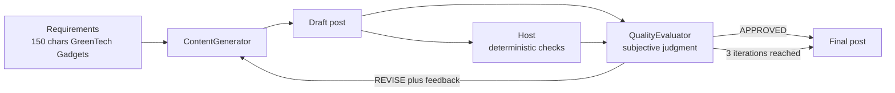

---
{
  "title": "Evaluator-Optimizer / Self-Correction Loop",
  "summary": "A generator revises against typed evaluator feedback while host code owns deterministic acceptance checks.",
  "category": "Reasoning & generation",
  "projects": [
    { "flavor": "AgentFramework", "path": "SelfCorrectionLoop.AgentFramework" },
    { "flavor": "SemanticKernel", "path": "SelfCorrectionLoop" }
  ]
}
---

## What it is

Also known as **Evaluator-Optimizer**, this uses two agents with strictly separated jobs. A
**generator** produces a draft. A **critic** checks it
against explicit requirements and answers with a verdict plus concrete feedback. If the verdict is
"revise", the draft and the feedback go back to the generator, and round two begins. The loop
stops on approval or on an iteration cap.

The separation is the whole trick. Asking one agent to write and grade its own work gets you
agreeable self-assessment; a critic with its own instructions — and an explicit *"never write the
post yourself, only critique"* — actually pushes back.

## Information-theoretic view

An LLM critic is an advisory signal, and advisory verdicts are proxies that drift under
pressure — a generator iterating until the critic approves is optimizing the critic, not the
requirements (Goodhart's law; see `docs/coordination-physics.md`). The Agent Framework flavor
draws the line in the right place: everything mechanically checkable — character limit,
required product name, forbidden terms — is owned by host code whose verdict cannot be
negotiated, and the critic is reserved for the residual judgment calls (clarity, tone) that no
`string.Length` can decide. That split is the mechanical-versus-advisory rule in miniature:
spend the hard gate on what can be hard, and let the soft signal cover only what is left.

## When to use it

- Output with checkable requirements: length limits, required mentions, tone, format.
- First drafts that are usually close but reliably miss one constraint.
- Anywhere a human reviewer would otherwise do one quick pass and send it back.

Skip it when the requirement is mechanically checkable — a character count is `string.Length`, not
an LLM call, and code beats a critic every time (that is what **Reflexion** does). Skip it for
subjective work with no agreed standard, where the loop just churns. Always cap the iterations:
two agents can disagree forever, and each round costs two calls.

## How the demo works

`ContentGenerator` writes social media posts and is told to output only the revised post. In Agent
Framework, `QualityEvaluator` judges clarity, engagement, tone, and persuasiveness while host code
owns the mechanical rules. In Semantic Kernel, the evaluator runs the original five-point checklist
and returns a textual verdict. The task is a post under 150 characters announcing "GreenTech
Gadgets", an eco-friendly product line.

The loop runs at most three iterations. Iteration one sends the raw requirements; every later
iteration sends requirements plus the previous draft plus the latest feedback. Agent Framework
uses a typed `Evaluation` containing `Approved`, `Score`, criterion results, and feedback. Host code
then overrides approval when the character limit, required product name, or forbidden-term check
fails. Semantic Kernel retains textual verdict parsing to show the contrast.

An independent evaluator here means a separately instructed evaluation role. Two roles using the
same deployment are not statistically independent models.

## Key APIs

- `agent.RunAsync<Evaluation>(...)` — typed evaluator output in Agent Framework.
- `HostEvaluation.Apply(...)` — authoritative deterministic criteria.
- `await foreach (var chunk in agent.InvokeAsync(prompt))` — Semantic Kernel streaming invocation.
- A plain `for` loop with a three-iteration cap — host-owned control flow in both flavors.

## What to watch in the output

Each round prints `--- Iteration i/3 ---`, the draft, and criterion-level pass/fail output in Agent
Framework; Semantic Kernel prints generator and evaluator text. Watch the draft change in the way
the previous feedback requested. The run ends with approval or an explicitly unapproved best
candidate after the iteration cap. **Reflexion** runs the same shape with a deterministic verifier instead of a
critic agent and retries from scratch rather than revising; **Evaluation and Monitoring** covers
the judging half on its own.
