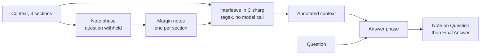

---
{
  "title": "Self-Note",
  "summary": "The model annotates the context before it sees the question, then answers from its own margin notes.",
  "category": "Reasoning & generation",
  "projects": [
    { "flavor": "AgentFramework", "path": "SelfNote.AgentFramework" },
    { "flavor": "SemanticKernel", "path": "SelfNote.SemanticKernel" }
  ]
}
---

## What it is

Give the model the source material *without* the question and ask it to write margin notes — key
facts, implications, connections. Weave those notes back into the original text. Only then show
it the question, against the annotated version.

The ordering is the trick. If the model sees the question first, its notes become a search for
supporting evidence: it annotates what it already believes the answer is and skips the rest.
Annotating blind forces an even pass over the whole context, so the material that turns out to
matter is already highlighted when the question arrives. It is how a careful reader works through
a textbook — notes in the margin on the first pass, exam questions later.

## When to use it

- Long or dense context where the relevant passage is not obvious up front.
- One document, many questions — annotate once, reuse the annotated version for each.
- Answers that must be traceable: the notes show which sections drove the conclusion.

Skip it when the context is short enough for the model to hold comfortably — you are paying for
an extra call and roughly doubling the context tokens to organize material that needed no
organizing. Skip it too when the question is a lookup, where retrieval beats annotation.

## How the demo works

The context is three sections on the Roman Empire — Trajan's territorial peak, the third-century
crisis, and Diocletian's division of the empire. The question, *"What were the key factors that
made the Roman Empire difficult to sustain?"*, is deliberately withheld from the note-writing
call. The middle step is **not** an LLM call: `InterleaveNotesWithContext` is plain C# that
regex-parses `[Note on Section N]:` lines out of the model's reply and injects each one as a
`    [Margin Note]:` after its matching section, appending anything unmatched as
`[Additional Note]:`. The final call then requires the model to write a `[Note on Question]`
before its `[Final Answer]`, grounding the answer in the annotations.

Both flavors run at temperature 0.3 and share the interleaving code almost verbatim; the
structural difference is how the two phases are expressed. Agent Framework gives each phase its
own named agent — `NoteAgent` and `AnswerAgent` — with the role baked into its instructions.
Semantic Kernel keeps one `IChatCompletionService` and builds a fresh `ChatHistory` per phase.
Either way the phases are isolated: nothing from the note call's history reaches the answer call
except the interleaved text itself.

## Key APIs

| Agent Framework | Semantic Kernel |
|---|---|
| `new ChatClientAgent(client, name: "NoteAgent", instructions:)` | `new ChatHistory()` + `AddSystemMessage(...)` |
| `new ChatClientAgent(client, name: "AnswerAgent", instructions:)` | second `ChatHistory` for the answer phase |
| `agent.RunAsync(prompt, options:)` — stateless, no session needed | `svc.GetChatMessageContentAsync(history, settings)` |
| `new ChatClientAgentRunOptions(new ChatOptions { Temperature = 0.3f })` | `new OpenAIPromptExecutionSettings { Temperature = 0.3 }` |

## What to watch in the output

The run opens with `Question:` and the phase banner — `── Phase 1: NoteAgent generating context
notes ──` in Agent Framework, `Phase 1: Generating context notes` in Semantic Kernel — then
`Generated Notes:` with the raw `[Note on Section 1]:` lines. `Interleaving notes with context`
is followed by `Interleaved Context:`, where you can see the indented `[Margin Note]:` lines
sitting under their sections; if a note ever lands under `[Additional Note]:`, the regex failed
to match and the model drifted from the requested format. The tail is `=== Final Answer ===`
containing `[Note on Question]:` and `[Final Answer]:`. **ChainofThoughts** is the same idea
applied to reasoning rather than to source material, and **PromptChaining** is the general shape
of feeding one call's output into the next.
