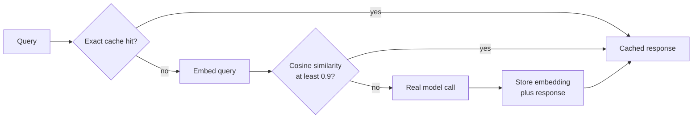

---
{
  "title": "Semantic Caching",
  "summary": "Reuse a cached answer when the new question means the same thing, not just when it matches.",
  "category": "Knowledge & state",
  "projects": [ { "flavor": "AgentFramework", "path": "SemanticCaching.AgentFramework" } ]
}
---

## What it is

An ordinary response cache keys on the exact request text, so *"What is the capital of
France?"* and *"Which city is the capital of France?"* are two different keys and two paid
model calls. Semantic caching keys on *meaning*: embed the incoming question, compare it to the
embeddings of questions already answered, and if the closest one is similar enough, return its
stored response.

The two layers stack. Exact-match caching is a free hash lookup, so it goes outermost; the
semantic layer costs one embedding call, so it goes underneath; the model is the last resort.

## When to use it

- Many users ask the same handful of questions in slightly different words — support, FAQ,
  docs assistants.
- Latency or cost per call matters more than getting a freshly worded answer every time.

Skip it when answers depend on time, user identity, or conversation state — a cached reply for
"what's my order status" is a bug, not a saving. Also skip it when the threshold would have to
be so high that hits become rare; you would pay for embeddings and get nothing back.

## How the demo works

`SemanticCachingChatClient` is a `DelegatingChatClient` that sits in a `ChatClientBuilder`
pipeline: `UseDistributedCache` (exact match, backed by `MemoryDistributedCache`) wraps the
semantic client, which wraps the real chat client. It embeds the last user message, scans its
in-memory `List` of `(embedding, response)` pairs with `TensorPrimitives.CosineSimilarity`, and
serves the best match when the score reaches the `0.9` threshold — high enough to accept close
paraphrases while rejecting merely related questions.

Four queries run through a `CachingAgent` with no shared session: a new question, the identical
question, a paraphrase, and an unrelated one.

The `Hits` / `Misses` / `LastSimilarity` counters on the delegating client are what the program
reads to classify each call.

## Key APIs

- `DelegatingChatClient` — the base class for wrapping an `IChatClient` with your own behaviour.
- `new ChatClientBuilder(inner).UseDistributedCache(...).Use(inner => ...)` — layering caches,
  cheapest check outermost.
- `MemoryDistributedCache` — the built-in exact-match store used for the outer layer.
- `IEmbeddingGenerator.GenerateVectorAsync(query)` — one embedding per uncached question.
- `TensorPrimitives.CosineSimilarity(cached, incoming)` — the similarity scan, an O(n) list
  walk that a persistent vector store would replace in production.

## What to watch in the output

Each call prints `User (<label>): <query>` then a status line: `[MISS]`, `[HIT(exact)]` or
`[HIT(semantic ~0.95)]`, followed by the elapsed milliseconds. The interesting rows are the
identical question — an exact hit in near-zero time — and the paraphrase, which only the
semantic layer can catch. The run ends with `Summary: 4 queries, 2 LLM calls, 2 saved by
caching.` **Middleware** shows the same `DelegatingChatClient` seam used for logging instead of
caching, and **RAG** uses the same embedding-plus-cosine machinery for retrieval.
