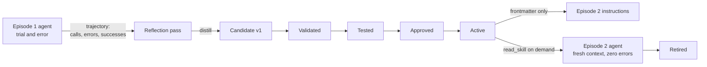

---
{
  "title": "Skill Learning",
  "summary": "Distill experience into a versioned skill that must validate, test, receive approval, and activate before use.",
  "category": "Learning & goals",
  "risk": "Persists model-authored instructions; deterministic checks and explicit review reduce but do not eliminate skill-poisoning risk.",
  "projects": [ { "flavor": "AgentFramework", "path": "SkillLearning.AgentFramework" } ]
}
---

## What it is

An agent that solved a task the hard way is holding knowledge that dies with its
context. Skill learning harvests it: a reflection pass reads the trajectory — every
tool call, every error, every eventual success — and distills it into a **file**:
`skills/<name>/versions/<n>/SKILL.md`, YAML frontmatter (name, one-line description) over a
step-by-step procedure, plus a host-owned manifest. Future sessions get only the active version's frontmatter index in their
instructions; the body stays on disk until an agent decides the skill is relevant and
reads it.

A generated file is only a **candidate**. The host moves each version through `candidate →
validated → tested → approved → active → retired`; `read_skill` exposes only the active version.

The produce/consume split is the point. **LearningAndAdaptation** learns rules into an
agent's own prompt; a skill is an artifact any future session — or a different agent
entirely — can pick up, version, and review. Consumption is progressive disclosure
(**ProgressiveToolDisclosure**) applied to procedures instead of tools.

## When to use it

- Recurring multi-step procedures with non-obvious constraints (exact formats, magic
  values, ordering) that agents currently rediscover by failing.
- Knowledge that should be shared across sessions and agents, not trapped in one
  conversation's memory.
- You want learned behavior to be inspectable — a SKILL.md can be code-reviewed;
  a prompt mutation cannot.

Skip it for one-off tasks, and for stable knowledge that belongs in the system prompt
outright. Distilled skills also rot: a skill captures the system as it *was*, so retire it when the
system changes. A model must never approve or activate its own candidate.

## How the demo works

Episode 1 provisions an employee against a system with undocumented conventions —
usernames must be `first.last` lowercase, the only license tier is `E5`, teams use ids
like `team-engineering-eu`, and the four steps must run in order. Nothing reveals this
but the error messages, so the agent flails productively (typically ~11 calls, ~7
failed). The full trajectory is then rendered as `CALL ...` / `-> result` lines and a
reflection prompt turns it into a candidate SKILL.md. `SkillLifecycle` validates exact frontmatter
and size, runs the provisioning contract test, records a trusted reviewer, and activates version 1.
The demo reviewer name represents an external human decision; production code should connect that
transition to its real review workflow.

Episode 2 is a **fresh agent against a fresh system instance**: its instructions
contain only the skill's frontmatter description plus a `read_skill` tool. It loads
the skill, follows the procedure, and provisions a different employee without a single
error.

## Key APIs

- `AgentResponse.Messages` → `FunctionCallContent` / `FunctionResultContent` — the raw
  trajectory, replayed as text for the reflection prompt.
- A plain `IChatClient.GetResponseAsync` call for distillation — reflection is just a
  model call with the trajectory in the prompt.
- `AIFunctionFactory.Create(...)` for `read_skill`, plus instance-method tools bound
  from the fake provisioning system.
- `SkillLifecycle` persists a versioned manifest and enforces legal promotion transitions.
- `ProvisionEmployeeSkillTests.Pass(...)` verifies the learned formats before review.

## What to watch in the output

Episode 1's stat line — `[Episode 1: 11 tool calls, 7 failed]` — is the cost of
ignorance; scroll the transcript to see the format errors teaching the agent one
constraint at a time. Then the distilled SKILL.md is printed in full: check that the
exact values (`first.last`, `E5`, `team-<department>-eu`) made it into the procedure,
because that is what makes the skill worth having. Episode 2 closes with
`[Episode 2: 5 tool calls, 0 failed]` — one `read_skill` plus the four provisioning
calls, first try, for an employee and department the skill never saw. **ExpeL** learns
insights across episodes in the same spirit; **RalphLoop** is where skill files
naturally accumulate across iterations. The final retirement line proves the skill is no longer
readable after deactivation.
