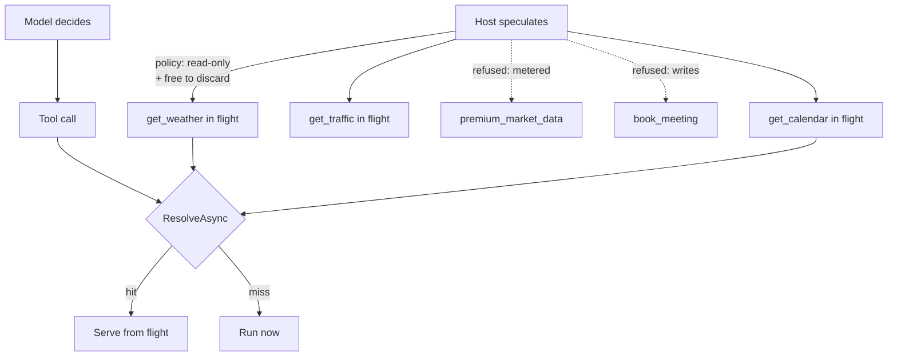

---
{
  "title": "Speculative Tool Execution",
  "summary": "Start the calls the model is probably about to make, and serve them from flight when it asks.",
  "category": "Orchestration",
  "projects": [
    { "flavor": "AgentFramework", "path": "SpeculativeToolExecution.AgentFramework" }
  ]
}
---

## What it is

Fire the likely tool calls *before* the model asks for them, while it is still deciding; when it
commits, serve from the results already in flight.

This is not **Parallelization**, and the difference is not a detail. Parallelization runs calls
the model has already committed to — everything it starts is work someone asked for. Speculation
runs calls that were never requested and may never be. It trades money for latency: every miss is
a billed call thrown away.

Because of that, only two kinds of tool may be speculated, and the host decides, not the model:
**read-only**, and **free to discard**. The second half is the one people skip. A metered API is
read-only and still fails the bar — throwing away its result costs real money. So does a
rate-limited search, and so does a read that writes an audit row. "Running it and discarding the
result must be indistinguishable from never running it" is the actual test.

## When to use it

- Slow tools plus predictable calls: a scheduling assistant that will almost certainly want the
  calendar, a support agent that will almost certainly want the account.
- Latency-sensitive interactive surfaces where a round trip is visible to a human.
- When you can measure the hit rate. Below roughly 50% on a slow tool, this is a cost increase
  wearing a performance improvement's clothes.

Skip it for cheap tools — the saving is invisible and the waste is not. Skip it entirely for
anything with side effects; a speculative side effect is a real side effect nobody asked for.
**SemanticCaching** is the better move when the same call recurs across runs, and
**CacheAwareContext** is the better move when the latency is in the prompt rather than the tools.

## How the demo works

`Speculator` holds a policy table of `SpeculatableTool(name, ReadOnly, FreeToDiscard)`. Five
speculations are attempted before the agent runs at all; three start and two are refused —
`premium_market_data` because it is metered, `book_meeting` because it writes. The refusal is
structural: `Speculate` never invokes the callback for a tool the policy rejects, so the "safe by
policy" claim is enforced by control flow rather than by convention.

The agent's tools are thin wrappers over `ResolveAsync(key, call)`. When the model calls
`get_weather("Berlin")`, the key matches a speculation in flight, so the pending `Task` is awaited
instead of a new call being made — the request has already been running for however long the
model spent deciding. A key with no speculation runs on demand. Either way the caller gets the
same value; speculation is invisible except in the timing.

`DrainAsync` at the end awaits every unclaimed speculation rather than abandoning it — a run that
exits with live work behind it is how a sample turns into a flaky test — and returns the count,
which is the waste.

The backends are `Task.Delay(600)` because at 5ms nothing about this pattern is observable.

## Key APIs

- `Speculator.Speculate(tool, key, call)` — returns `false` and **does not invoke `call`** for a
  tool the policy has not cleared.
- `Speculator.ResolveAsync(key, call)` — the single entry point the tools use. Awaiting a stored
  `Task<string>` is what makes a hit free; the work started earlier.
- `SpeculatableTool.CanSpeculate => ReadOnly && FreeToDiscard` — the policy, in one line, host-side.
- `Stopwatch.GetTimestamp()` / `GetElapsedTime(...)` for the in-flight timings.
- `Speculator.DrainAsync()` — awaits the unclaimed and reports the waste.

## What to watch in the output

The opening block shows which speculations started and which were refused, with the policy reason
next to each. Then the answer, with total elapsed time.

The `=== Speculation ===` section is the one that decides whether you would ship this. `hit` lines
carry how long the call had already been in flight when the model asked for it — that is the
latency saved. `miss` lines are calls that ran on demand. The closing ratio (`N/M tool calls
served from speculation; K speculation(s) discarded unused`) is the number to reason about: two
hits and three discarded calls is a 40% hit rate, which on a 600ms tool is a good trade and on a
20ms tool is not.

Change the question so the model asks about a different city and re-run: the weather speculation
misses, the wasted count rises, and the trade-off stops being theoretical.

**Parallelization** for committed concurrent work, **SemanticCaching** for repeats across runs,
**ResourceAwareOptimization** for the other half of the cost conversation.
