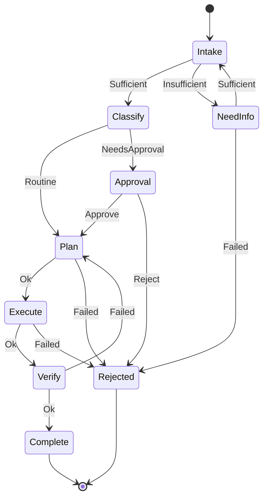

---
{
  "title": "State Machine Agent",
  "summary": "The host owns the legal transitions; the model supplies one bounded decision per state.",
  "category": "Orchestration",
  "projects": [
    { "flavor": "AgentFramework", "path": "StateMachineAgent.AgentFramework" }
  ]
}
---

## What it is

A workflow written as a transition table in C#, with a model filling in the judgement at each
state.

Compare it to an agent loop. There, the model decides what happens next, and the constraints live
in a prompt — which means "Execute is unreachable without Approval" is a sentence you hoped held,
not a property you can check. Here the reachable next steps are a `Dictionary<State,
Dictionary<Decision, State>>`. The model is asked one bounded question per state — *"is this
expense routine or does it need approval?"* — and hands back a decision from a menu the host
printed for it. An answer outside that menu is an exception, not a new branch.

What you get for the loss of flexibility is worth naming precisely: you can print the graph, you
can prove by inspection which states are reachable from which, and you can bound every loop. That
is the difference between an agent you can deploy into a regulated process and one you cannot.

## When to use it

- Business and regulated workflows with named stages, mandatory gates, and an audit requirement:
  claims, onboarding, approvals, KYC, returns.
- Anywhere "how did it get to this step" must be answerable after the fact.
- When the process is known and the judgement inside each step is what actually needs a model.

Skip it when the process is genuinely open-ended — a research task has no useful state graph, and
**Magentic** or **RalphLoop** are the right shapes there. Skip it too when there is only one path:
that is **PromptChaining** with fewer moving parts. And if what you need is a *validated dynamic*
plan rather than a fixed graph, that is **Planning** (the model proposes the sequence, the host
validates it) rather than this (the host owns the sequence outright).

## How the demo works

An expense claim — EUR 412.80, receipt attached, **cost centre missing** — moves through
`Intake → Classify → Plan → Approval → Execute → Verify → Complete`, with `NeedInfo` and
`Rejected` off to the sides.

Each turn the host prints the current state, a one-line brief on **what this step decides**, and
`ExpenseMachine.Allowed(state)`. The `CaseWorker` agent returns one `Decision` plus a sentence of
reasoning as structured output.

The step brief is not decoration, and leaving it out produced a real intermittent bug. A state
*name* does not tell the model what it is being asked, and the running fact log still contains
`Intake: Insufficient - missing cost centre`. Without the brief, `NeedInfo` read that entry,
concluded the deficiency "cannot be corrected at this step", and answered `Failed` — rejecting a
claim whose gap the host had just closed one line earlier. Intermittently, at temperature 0.
Naming the question is the host's job for the same reason the menu is: the model supplies
judgement *inside* a step, so the step has to be legible.

Five host-owned mechanisms surround that call:

- **The menu.** The model chooses from the legal decisions at this state, never names a state.
  Mapping decision → state is the host's.
- **The brief.** One sentence per state saying what is being decided, and — where the fact log
  could mislead — saying explicitly to judge the claim as it stands now.
- **Off-menu handling.** A decision that fails `Enum.TryParse` or is not in `Allowed` is refused
  and downgraded to `Failed` (or the last legal option). The model's answer is untrusted input
  and is parsed as such.
- **`IllegalTransitionException`.** `Next` throws rather than guessing. A wrong transition is a
  bug to surface, not a value to coerce into the nearest legal state.
- **`VisitBudget`.** Cycles are legal here — `Verify → Plan` on a failed check, `NeedInfo →
  Intake` once the gap is filled — so termination cannot be read off the table. A per-state visit
  budget answers it instead: three visits to any state ends the run, visibly, in `Rejected`.

Side effects are the host's too, keyed to the state and run **on entering it, before the model is
asked anything** — never triggered by the model mentioning them. `NeedInfo` means "go and get the
missing field", so the cost centre is fetched on entry and the model is then asked whether what it
now has is sufficient. The other order — ask first, fetch afterwards — puts the model in a state it
can never leave, because it is being asked about a gap that is still open.

## Key APIs

- `ExpenseMachine.Allowed(state)` / `.Next(state, decision)` — the table, and the only way to move.
  `Next` throws `IllegalTransitionException` on an illegal pair.
- `ExpenseMachine.IsTerminal(state)` — a state with no outgoing transitions, which is also the
  loop condition; there is no separate "done" flag to keep in sync.
- `agent.RunAsync<Verdict>(prompt, options:)` at temperature 0 — the decision is a classification,
  not a creative act.
- `VisitBudget.TryVisit(state)` — bounds every cycle. The budget blowing is a real outcome the
  caller sees, not a silent hang.

## What to watch in the output

Each line reads `[State] --Decision--> NextState (reason)`. The path to watch on the default
claim: `Intake --Insufficient--> NeedInfo` (no cost centre), then `NeedInfo --Sufficient-->
Intake` after the host fills it, then `Intake --Sufficient--> Classify`, and `Classify
--NeedsApproval--> Approval` because EUR 412.80 is over the EUR 250 policy line. The claim
reaches `Execute` only through `Approval`, and the transition table is why that is guaranteed
rather than hoped.

`rejected off-menu decision '…'` means the model answered outside its menu — worth noticing, and
harmless, which is the point. `[budget] Plan visited 3 times; stopping.` means a loop hit its
bound. The trailing log replays every transition with its reasoning: that block is the audit
trail this pattern exists to produce.

**Planning** validates a model-proposed sequence; **DurableExecution** makes a workflow survive a
restart; **HumanInTheLoop** is what the `Approval` state becomes when a person rather than a
model answers it.
