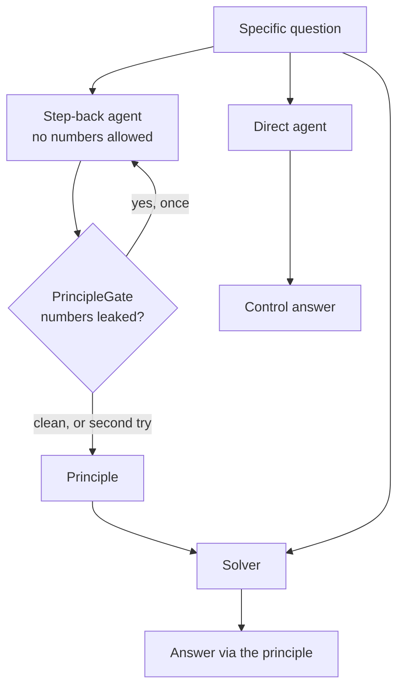

---
{
  "title": "Step-Back Prompting",
  "summary": "Ask for the governing principle first, with the question's specifics withheld, then answer by applying it.",
  "category": "Reasoning & generation",
  "projects": [
    { "flavor": "AgentFramework", "path": "StepBack.AgentFramework" }
  ]
}
---

## What it is

One extra call, made before the answer: *what general principle is this question an instance
of?* Then answer with that principle supplied.

It works for the reason a physics tutor makes you name the conservation law before touching the
numbers. Retrieving the right general rule is an easier retrieval problem than retrieving the
specific answer — the rule is stated thousands of times in training data, the specific case
perhaps never — and once the rule is on the table, the specific answer becomes a substitution
rather than a recall. The abstraction step is cheap and the concretion step is nearly mechanical.

The failure mode is equally specific, and is what the host guards: the model states the
"principle" *with the question's numbers in it*. That is the answer wearing a hat. The
abstraction bought nothing, and you have paid for two calls to get one.

## When to use it

- Questions with a governing rule the model knows but may not reach for: physics, law, tax,
  policy, anything where the right frame is most of the work.
- Retrieval front-ends: the principle makes a far better search query than the specific question,
  because it uses the vocabulary the source documents use.
- When the direct answer is confidently wrong in a *systematic* way — that usually means the
  wrong frame, not a wrong computation, and this fixes frames.

Skip it when the question is a lookup or a single arithmetic step; the extra call is pure
overhead. Skip it when there is no general rule — a question about one specific contract has no
principle to step back to. **ChainofThoughts** decomposes within the specifics; this is the
opposite move, away from them.

## How the demo works

The question — a 2.0 kg block on a frictionless 5.0 m ramp at 30°, plus "would a 4.0 kg block be
faster?" — is one where the frame decides the answer. Reach for kinematics and you grind through
components; reach for energy conservation and the second half is immediate and the mass cancels.

Three calls:

1. **Step back.** An agent that is told, in as many words, not to solve the question and not to
   use any number from it. Two or three sentences naming the governing law.
2. **Gate.** `PrincipleGate.LeakedSpecifics` extracts every number from the question and every
   number from the principle and reports the overlap. Non-empty means the principle carried the
   specifics; the sample retries **once**, naming the leaked values in the retry prompt. If it
   leaks again the run continues and says so — a leaky principle still helps, it just no longer
   demonstrates that the abstraction did the work.
3. **Answer,** with the principle supplied above the question.

Then a fourth call the pattern does not need: the same question, same model, same temperature,
*no principle*. Printing both is deliberate. On an easy question the two answers agree, and the
comparison shows you paid two calls for nothing — which is the honest result and the thing most
write-ups of this pattern leave out. The pattern earns its keep on questions where the direct
answer reaches for the wrong rule, and seeing the control makes that visible instead of assumed.

## Key APIs

- `abstracter.RunAsync(question, options:)` at temperature 0.1 — the principle should be the
  same every time; this is retrieval, not creativity.
- `PrincipleGate.LeakedSpecifics(question, principle)` — a `[GeneratedRegex]` number scan on both
  sides, returning the intersection. Cheap, and it catches the only failure that matters.
- A one-shot retry that names the leaked values back to the model, rather than a loop — two
  attempts and then continue, because an unbounded "try again" on a soft criterion is how a
  sample becomes a hang.

## What to watch in the output

If `[gate] principle carried the question's specifics (2.0, 5.0)` appears, the first attempt
answered instead of abstracting — that line is the pattern's own failure mode being caught, and
seeing it occasionally is normal.

`=== Principle ===` should name a law and say what it implies in general terms, with no `2.0`,
no `30`, no `5.0`. Then compare the two answers below it. Both should get 7 m/s; what to look at
is the *reasoning*, and especially the comparative half. The principled answer should say the
mass cancels because the energy equation has no mass in it. If the direct answer computes both
masses separately and reports the same number, you are watching the difference between applying
a rule and re-deriving one — same output, different reliability.

**SelfNote** withholds the question to keep annotation unbiased; this withholds the numbers to
keep abstraction honest. **LeastToMost** decomposes downward into steps where this abstracts
upward into rules.
