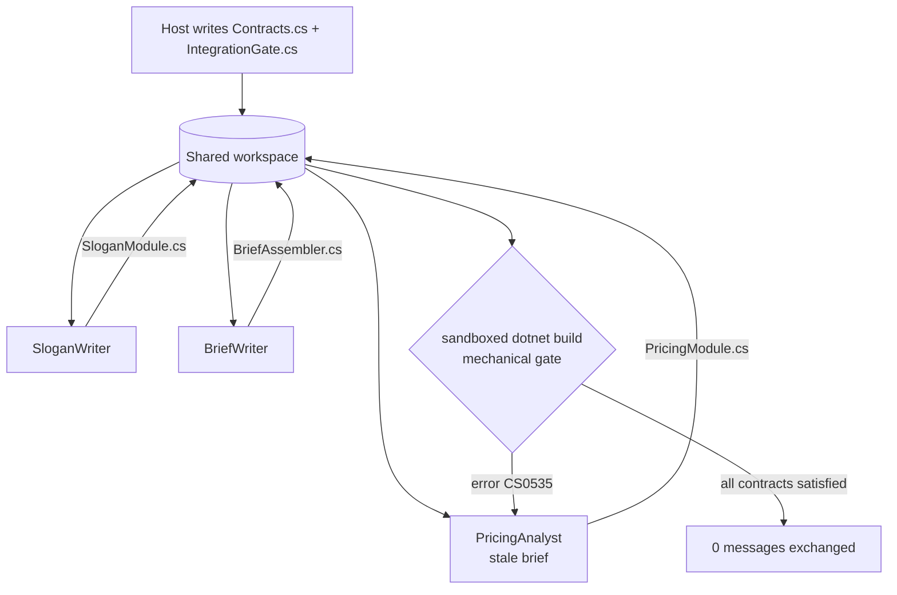

---
{
  "title": "Stigmergic Coordination",
  "summary": "Workers coordinate through a shared workspace and compiler-enforced contracts instead of exchanging messages.",
  "category": "Orchestration",
  "projects": [
    { "flavor": "AgentFramework", "path": "StigmergicCoordination.AgentFramework", "environmentAllowlist": [
      "AzureOpenAi__ChatModelDeployment", "AzureOpenAi__EmbeddingModelDeployment",
      "AzureOpenAi__Endpoint", "AzureOpenAi__ApiKey",
      "AGENTIC_PATTERNS_ALLOW_UNSAFE_HOST_EXECUTION", "AGENTIC_PATTERNS_ACKNOWLEDGE_UNSAFE_CODE_EXECUTION"
    ] }
  ]
}
---

## What it is

Every other coordination pattern in this catalog is dialogue-shaped: agents talk, and a manager
or protocol decides who talks next. Stigmergy — the term comes from how termites coordinate
nest-building through the mound itself, not through signals to each other — replaces the
conversation with a shared **environment**: a workspace directory, typed contracts, and a
mechanical gate. Workers read the environment, produce their piece, and the environment tells
everyone whether the pieces fit. Nobody relays state; nobody summarizes anybody.

The orchestrator here is deliberately trivial. It launches workers and runs the gate. It never
forwards a message from one agent to another, because there are no messages to forward.

## Information-theoretic view

Dialogue coordination pays twice per hop: every message is a compression of the sender's state,
and every re-encoding shades it (see `docs/coordination-physics.md`). With *n* agents in a group
chat the channel noise scales with the pairs, O(n²); here each worker touches only the shared
artifacts, O(1) per worker, and the artifact is identical for every reader — a contract file
cannot be paraphrased in transit. The gate is the other half: a compiler verdict is a hard
constraint that does not degrade through layers, unlike advisory review. And the retry loop is
the re-grounding escape hatch — the failing worker is pointed back at the authoritative
contract, not at somebody's summary of it.

## When to use it

- The task decomposes into components with a small, precise interface between them.
- The interfaces can be written down as machine-checkable contracts — types, schemas, tests.
- You want integration verified by a gate that cannot be argued with, instead of by agents
  reassuring each other in chat.

Skip it when the decomposition itself is the hard part, or the components need to negotiate
ambiguous judgment calls mid-flight — that residual is what dialogue (or a **Magentic**-style
manager) is for. And for any task that fits one agent's context, use one agent: coordination
of any flavor only adds overhead (arXiv:2512.08296 measures the penalty).

## How the demo works

The task is the same domain as **MultiAgentCollaboration** — marketing for an eco-friendly
electric vehicle — but shaped as a three-component system: `SloganModule`, `PricingModule`, and
`BriefAssembler`. The host writes `Contracts.cs` (shared records and interfaces) and
`IntegrationGate.cs` — a never-executed class whose only job is to *compile*: it instantiates
each worker's class where its interface is expected, so a wrong name or signature anywhere
fails the build. Three workers run concurrently, each producing one C# file into a temp
workspace. The gate is a sandboxed `dotnet build`.

One trap is deliberate: the Pricing worker's brief quotes a **stale interface**
(`IReadOnlyList<decimal> GetPrices()`) instead of the real contract
(`PricingTier[] GetTiers(ProductSpec)`). That is the spec drift dialogue-based teams discover
at integration time, if at all. Here the compiler catches it in round 1 with a `CS0535`, the
error routes by file name back to the owning worker along with the authoritative contract, and
round 2 passes.

The model's code is compiled but **never executed** — the compiler is the integration test.
But compiling is not risk-free either: build tasks, source generators, and MSBuild targets all
run as part of a build, not just at execution time, so `dotnet build` still runs inside the
same locked-down container boundary **CodeAct** uses for model-generated code — no network,
read-only source mount, a bounded writable build directory, capped CPU/memory/pids, a
wall-clock timeout, and bounded output. The image differs, though: this sample pulls the stock
`mcr.microsoft.com/dotnet/sdk` image from the network on first use, rather than CodeAct's
repo-controlled image with an offline package cache baked in — same isolation flags, different
image provenance. The sample fails closed with no fallback to a host build unless the same
double opt-in CodeAct offers is set (and even then the timeout and source-size cap still
apply). A nonzero exit with no compiler diagnostic — a permission mismatch on the mount, a
resource-limit kill, an image-pull failure — is reported as a gate error too, never as a
silent pass. A production version would go further and add behavioral contract tests running
in that same sandbox.

## Key APIs

The point of this pattern is which APIs it *doesn't* need: no group chat builder, no manager,
no workflow. The coordination machinery is the environment itself.

- `ChatClientAgent(client, instructions, name)` — one plain agent per worker, no tools.
- `Task.WhenAll(...)` — workers run concurrently precisely because they share no channel.
- `File.WriteAllText` into a shared workspace — the write *is* the coordination act.
- `BuildGate.RunAsync` / `SandboxRunner.RunAsync` — the mechanical gate, run inside a
  container; its `error CS*` lines are parsed and routed to the worker owning the failing file.

## What to watch in the output

Each worker logs `[worker] Role -> File.cs (n lines, no messages to other workers)`. Then
`=== Build gate: round 1 ===` prints the `CS0535` from the stale pricing brief and
`-> gate feedback for PricingAnalyst`. Round 2 prints `PASSED`, dumps every file in the shared
environment, and closes with `Messages exchanged between workers: 0. The workspace did all the
talking.` Compare with **MultiAgentCollaboration**, where the same domain is coordinated by
turn-taking dialogue, and **RalphLoop**, which is stigmergy across *time* — one agent's
iterations coordinating with each other through files. **SelfNote** is the n=1 version of the
same idea.
