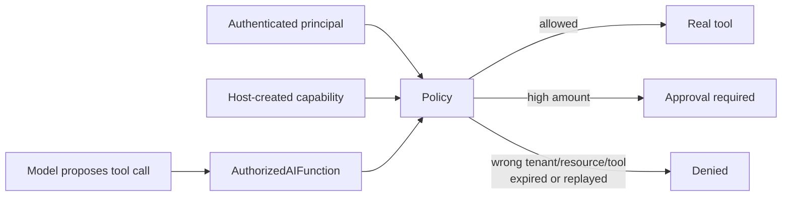

---
{
  "title": "Tool Authorization / Capability Scoping",
  "summary": "Authorize each concrete tool invocation against caller, tenant, resource, amount, expiry, and replay constraints.",
  "category": "Production controls",
  "projects": [ { "flavor": "AgentFramework", "path": "ToolAuthorization.AgentFramework" } ]
}
---

## What it is

Giving the model a tool definition says what it can *propose*. It does not prove the current user
may perform that operation against those arguments. Tool authorization wraps execution in a
trusted-host policy that checks the authenticated principal and a narrow capability grant.

> Tool discovery determines what the model can see. Tool authorization determines what the
> application will execute.

The capability is created by host code and kept in runtime context. The model receives neither a
credential it can edit nor authority to expand the grant.

## When to use it

- Tools read or mutate tenant-owned resources.
- An amount, account, order, region, or time window narrows an otherwise valid tool.
- High-risk invocations should escalate to approval instead of being silently allowed or denied.

**Progressive Tool Disclosure** is the visibility gate. **Tool Authorization** is the deterministic
execution gate. **Human in the Loop** is the decision gate for a particular high-risk invocation.

## How the demo works

A customer-support principal receives separate short-lived capabilities for `GetOrder` and
`IssueRefund`. `AuthorizedAIFunction` intercepts the concrete arguments before calling the inner
function. The policy normalizes order IDs, checks tenant and ownership, enforces the exact tool
name, denies missing or malformed authorization inputs, turns refunds over €50 into
`ApprovalRequired`, and can consume one-time nonces.

`DeleteCustomer` is not registered at all. `GetInternalFraudScore` fails because a `GetOrder`
capability cannot authorize another tool. Those are separate from the argument-level denial when
the current customer asks for someone else's order.

## Key APIs

- `DelegatingAIFunction.InvokeCoreAsync(...)` — the final host-side enforcement point.
- `ToolCapability` — immutable subject, tenant, exact tool, resource, amount, expiry, and nonce.
- `ToolAuthorizationPolicy.Authorize(...)` — returns `Allowed`, `Denied`, or `ApprovalRequired`.
- `RunPrincipal` — authenticated identity supplied by the application, never by the prompt.

## What to watch in the output

The five probes show: own order allowed, another customer's order denied, €25 refund allowed,
€500 refund escalated, and a tool absent from the grant denied. Each decision is printed before
the underlying function can run.
