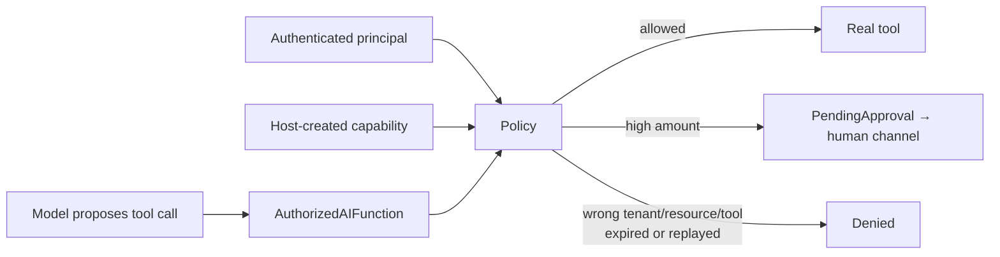

---
{
  "title": "Tool Authorization / Capability Scoping",
  "summary": "Authorize each concrete tool invocation against caller, tenant, resource, amount, expiry, and replay constraints, reserving a one-time capability until the effect is committed.",
  "category": "Production controls",
  "projects": [ { "flavor": "AgentFramework", "path": "ToolAuthorization.AgentFramework" } ]
}
---

## What it is

Giving the model a tool definition says what it can *propose*. It does not prove the current user
may perform that operation against those arguments. Tool authorization wraps execution in a
trusted-host policy that checks the authenticated principal and a narrow capability grant.

> Tool discovery determines what the model can see. Tool authorization determines what the
> application will execute.

The capability is created by host code and kept in runtime context. The model receives neither a
credential it can edit nor authority to expand the grant.

## When to use it

- Tools read or mutate tenant-owned resources.
- An amount, account, order, region, or time window narrows an otherwise valid tool.
- High-risk invocations should escalate to approval instead of being silently allowed or denied.

**Progressive Tool Disclosure** is the visibility gate. **Tool Authorization** is the deterministic
execution gate. **Human in the Loop** is the decision gate for a particular high-risk invocation.

## How the demo works

A customer-support principal receives separate short-lived capabilities for `GetOrder` and
`IssueRefund`. `AuthorizedAIFunction` intercepts the concrete arguments before calling the inner
function. The policy normalizes order IDs, checks tenant and ownership, enforces the exact tool
name, denies missing or malformed authorization inputs, turns refunds over €50 into
`ApprovalRequired`, and reserves one-time nonces.

Two design choices carry as much weight as the checks themselves.

**A refusal is not a tool result.** `AuthorizedAIFunction` throws `ToolAuthorizationException`
rather than returning `"ApprovalRequired: ..."` as the function's output. Handing a refusal back on
the tool channel gives the model a sentence to paraphrase — frequently into a claim that the work
was done — and puts an approval request somewhere the model can answer. The host catches the
exception, routes `decision.PendingApproval` to a human, and decides what the model is told.

Throwing is necessary but not by itself sufficient: it keeps the refusal off the tool channel only
because this host invokes the function directly. Run the same wrapper under
`FunctionInvokingChatClient` — the loop the diagram above implies — and the framework catches the
function's exception and feeds the model a generic error, discarding the `PendingApproval` entirely.
A host on that path has to intercept the exception before the invocation loop does. The
`PendingApproval` carries a *snapshot* of the arguments, not the caller's live dictionary, so the
approver judges the values that were actually authorized.

**The amount check does not depend on the grant carrying a ceiling.** `IssueRefund` is a
money-moving tool: an absent, negative, or unparseable `amount` is refused whether or not
`MaximumAmount` is set. A configured maximum only adds the ceiling on top of that floor.

`DeleteCustomer` is not registered at all. `GetInternalFraudScore` fails because a `GetOrder`
capability cannot authorize another tool. Those are separate from the argument-level denial when
the current customer asks for someone else's order.

## One-time capabilities: reserve, then commit

This sample demonstrates **reserve/commit**, not the idempotency-key alternative — the two solve
the same replay problem and shipping both would just be two half-enforced ledgers.
(`IdempotentToolCalls` is where the idempotency-key design lives, and it keeps its dedup record
with the side effect, which is the right home for it.)

`Authorize` moves a one-time nonce `Available -> Reserved`. `Commit` moves it `Reserved ->
Consumed` once the effect is durable; `Release` moves it back to `Available` after a *verified*
pre-effect failure. Burning the nonce inside `Authorize`, as an earlier version did, destroyed a
valid capability whenever the tool failed before doing anything.

`AuthorizedAIFunction` commits after the inner call returns and deliberately does **not** release
when it throws: from inside the wrapper the failure is unverified — the effect may well have
happened — so the reservation stands and the capability fails closed. `Release` stays a caller-
driven act for a failure the caller has confirmed was pre-effect.

The honest gap: **nothing here resolves a reservation whose commit never arrives.** If the host
crashes between reserve and commit, the capability is stranded in `Reserved` forever, and because
the ledger is an in-process `ConcurrentDictionary` a restart forgets it instead. A real system
gives a reservation a lease with an expiry and a sweeper that decides — by asking the downstream
system whether the effect landed, not by guessing — whether an expired reservation becomes
`Consumed` or `Available`. Better still, it stores the three states in the same transactional store
that owns the side effect, so the commit is atomic with the effect and the question never arises.

## Key APIs

- `DelegatingAIFunction.InvokeCoreAsync(...)` — the final host-side enforcement point.
- `ToolCapability` — immutable subject, tenant, exact tool, resource, amount, expiry, and nonce.
- `ToolAuthorizationPolicy.Authorize(...)` — returns `Allowed`, `Denied`, or `ApprovalRequired`, and
  reserves a one-time capability rather than consuming it.
- `ToolAuthorizationPolicy.Commit(nonce)` / `Release(nonce)` — the two ends of the reservation.
- `CapabilityState` — `Available`, `Reserved`, `Consumed`.
- `AuthorizationDecision.PendingApproval` — tool name, argument snapshot, and reason for the human
  channel.
- `ToolAuthorizationException` — how a refusal leaves the tool-result channel.
- `RunPrincipal` — authenticated identity supplied by the application, never by the prompt.
- `IApprover` / `DemoApprover` — the approval channel, and the deliberately obvious fake behind it.

## What to watch in the output

The probes show: own order allowed, another customer's order refused, €25 refund allowed, and a
€500 refund escalated — printed as an out-of-band approval request, then executed only after an
approver mints a *new* single-use capability sized to that exact request. The original capability
is never widened, and the model plays no part in producing the new grant. A one-time `GetOrder`
capability then succeeds once and is refused on replay, and a tool absent from the grant is
refused. Each decision is printed before the underlying function can run.

The approver's answer in the sample is a constant — it must run unattended, so it cannot block on
`Console.ReadLine`. That constant lives behind `IApprover` in a class called `DemoApprover`, which
announces `[DEMO APPROVER: automatically approving …]` on every call, rather than as a bare
`var approverApproved = true;`. The distinction is the point of the naming: a boolean copied into a
real host is a silent auto-approver no reviewer notices, whereas a `DemoApprover` in production is
obvious on sight and the interface says exactly what has to replace it.
`DurableHumanInTheLoop` is where the real version of that wait lives.
