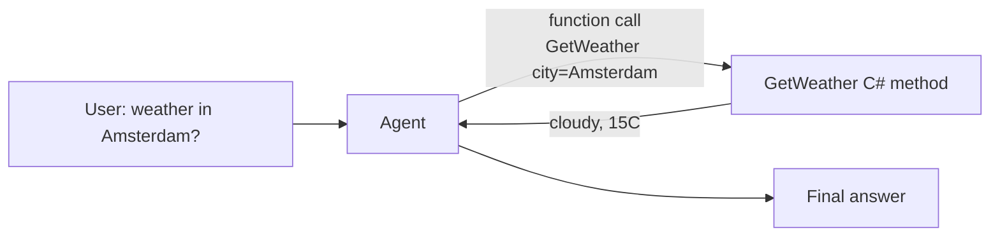

---
{
  "title": "Tool Use",
  "summary": "Give the model C# methods it can call, and let it decide when to call them.",
  "category": "Orchestration",
  "projects": [
    { "flavor": "AgentFramework", "path": "ToolUse.AgentFramework" },
    { "flavor": "SemanticKernel", "path": "ToolUse.SemanticKernel" }
  ]
}
---

## What it is

A language model can only produce text. Tool use (also called function calling) closes that
gap: you describe a set of functions to the model, and when a request needs one, the model
answers with a structured call instead of prose. The framework executes your C# method, feeds
the result back, and the model continues with the real value in hand.

The loop is always the same — **model decides → framework invokes → result returns → model
answers**. Every other pattern in this repo builds on it.

## When to use it

- The answer depends on data the model cannot know: live weather, prices, your database.
- The task has a side effect: create a ticket, send an email, write a file.
- You want deterministic arithmetic or lookup instead of the model guessing.

Skip it when a plain prompt already gets it right — each tool adds tokens to every request
and one more thing the model can get wrong.

## How the demo works

Both samples expose a single `GetWeather(city)` function and ask *"What is the weather like in
Amsterdam?"*. The model has no weather knowledge, so it must call the tool; the printed answer
contains "cloudy, 15°C", which only the tool could have supplied.

The two flavors differ only in how the function is described to the model:

- **Agent Framework** wraps a plain method with `AIFunctionFactory.Create(GetWeather)`; the
  name, parameters, and description come from reflection and XML metadata.
- **Semantic Kernel** imports a plugin *class* (`kernel.ImportPluginFromType<WeatherPlugin>()`)
  whose methods carry `[KernelFunction]` and `[Description]` attributes, and enables calling
  with `FunctionChoiceBehavior.Auto()`.

## Key APIs

| Agent Framework | Semantic Kernel |
|---|---|
| `AIFunctionFactory.Create(method)` | `[KernelFunction]` + `[Description]` |
| `new ChatClientAgent(client, instructions, tools: [...])` | `kernel.ImportPluginFromType<T>()` |
| `agent.RunAsync(prompt)` | `FunctionChoiceBehavior.Auto()` |

> Naming trap: `AIFunctionFactory.Create` on a *local* function picks up the compiler-mangled
> name. Pass the name explicitly — `AIFunctionFactory.Create(GetWeather, nameof(GetWeather))` —
> whenever the tool is a local or lambda function.

## What to watch in the output

The demo prints only the final answer, so the tool call itself is invisible; the tell is that
the temperature matches the hard-coded string in `GetWeather`. The **Middleware** pattern shows
how to log every call, and **ReasoningAndActing** shows a loop with several of them.
