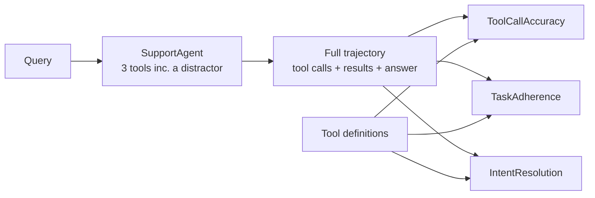

---
{
  "title": "Trajectory Evaluation",
  "summary": "Judge the agent's path — tool choice, order, redundancy — not just its final answer.",
  "category": "Evaluation",
  "projects": [
    { "flavor": "AgentFramework", "path": "TrajectoryEvaluation.AgentFramework" }
  ]
}
---

## What it is

An agent can reach the right answer the wrong way: calling three tools where one would do,
picking a distractor tool and recovering, or getting lucky on a question it never actually
understood. Final-answer evaluation is blind to all of it. Trajectory evaluation scores the
**path** — the sequence of tool calls and results — using the agent-specific evaluators in
`Microsoft.Extensions.AI.Evaluation.Quality`:

- **`ToolCallAccuracyEvaluator`** — were the right tools called, with the right arguments?
- **`TaskAdherenceEvaluator`** — did the agent stay on the assigned task?
- **`IntentResolutionEvaluator`** — did it actually resolve what the user intended?

**Builds on:** **EvaluationAndMonitoring**'s trajectory middleware *counts* calls and latency —
"the third call was slow"; this pattern judges whether those calls were the *right* ones —
"the third call should not have happened". **ToolUse** is the mechanism under evaluation.

## Information-theoretic view

Final-answer accuracy is a lossy summary of a run: it throws away the entire path and keeps one
bit. That is fine until the path is where the failure lives — an agent that answers correctly by
accident has a trajectory that will not survive the next question, and the answer-only metric
cannot see it coming (see `docs/coordination-physics.md`). Scoring the trajectory recovers the
information the summary discarded, which is exactly the information that predicts whether the
behavior generalizes.

## When to use it

- Multi-tool agents where *how* the answer was reached matters as much as the answer.
- Cost or latency regressions that show up as redundant or wasteful tool calls.
- Debugging an agent that is "right but expensive" — the metric that names why.

Skip it for a single-shot agent with no tools: there is no trajectory to judge, and
**LLMAsJudge** on the final answer is the whole story.

## How the demo works

A `SupportAgent` is given three tools — `GetSupportPolicy`, `CheckWarrantyStatus`, and a
deliberate distractor `GetStoreLocations` that is irrelevant to support questions. Two queries
run; each `RunAsync` returns the full trajectory in `response.Messages` (assistant tool-call
messages, tool results, final answer). That message list, prefixed with the user turn, is scored
by all three agent evaluators, each receiving the tool definitions through its context.



The distractor tool is the point: a clean trajectory ignores it, and the evaluators' reasoning
strings say so. The evaluators are experimental (`AIEVAL001`), so the project opts in with a
`NoWarn`.

## Key APIs

| API | Role |
|---|---|
| `agent.RunAsync(query)` → `response.Messages` | Captures the full trajectory including tool calls/results |
| `ToolCallAccuracyEvaluator` / `TaskAdherenceEvaluator` / `IntentResolutionEvaluator` | The agent evaluators |
| `ToolCallAccuracyEvaluatorContext(tools)` (and the two siblings) | Passes tool definitions to the evaluator |
| `result.Get<EvaluationMetric>(name)` → `BooleanMetric` / `NumericMetric` | Reads the verdict back |
| `<NoWarn>$(NoWarn);AIEVAL001</NoWarn>` | Opts into the experimental agent evaluators |

```bash
dotnet run --project TrajectoryEvaluation.AgentFramework
```

## What to watch in the output

Each query prints its answer and three metric lines with the evaluators' reasoning — a boolean
for tool-call accuracy, ratings for adherence and intent resolution. The warranty-status query
(which genuinely needs `CheckWarrantyStatus`) and the policy query (which needs only
`GetSupportPolicy`) should both leave the distractor untouched; the reasoning strings are where a
wasteful path would show up. **EvaluationAndMonitoring** counts what these calls cost;
**ToolUse** is the pattern being measured.
