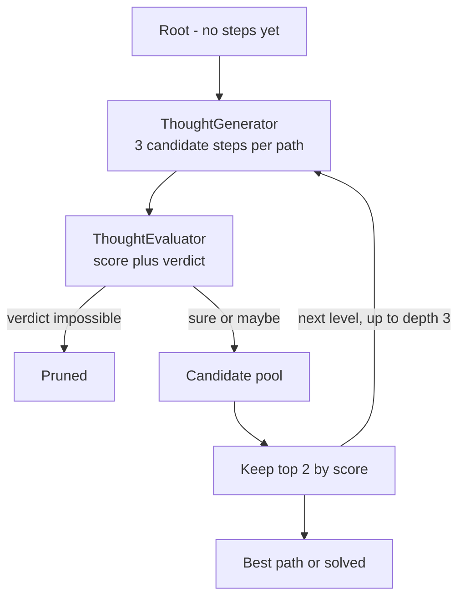

---
{
  "title": "Tree of Thoughts",
  "summary": "Branch into several candidate steps, score each partial path, prune, and keep only the best.",
  "category": "Reasoning",
  "projects": [ { "flavor": "AgentFramework", "path": "TreeOfThoughts" } ]
}
---

## What it is

Chain of Thought commits to one path and lives with it — a bad first step poisons everything
after it. Tree of Thoughts turns reasoning into search: at each step, generate several candidate
"thoughts", have an evaluator score each partial path, throw away the dead ends, and expand only
the best survivors. It is beam search where the successor function and the heuristic are both
language models.

The three knobs are the classic search knobs: **depth** (how many steps), **breadth** (candidates
per expansion), **beam width** (paths kept per level).

## When to use it

- Problems where a step is verifiably a dead end before the whole answer exists — puzzles,
  planning, constraint satisfaction, code search.
- Tasks where the model's first idea is usually wrong but its judgement of an idea is decent.

Skip it when the work is linear or the evaluator cannot tell good from bad partway through —
without a meaningful score, beam search degrades to expensive random sampling. And price it
first: this demo is up to depth times beam times breadth generator-plus-evaluator round trips,
which makes it by far the most expensive reasoning pattern here.

## How the demo works

The task is Game of 24: use 4, 9, 10 and 13 exactly once with `+ - * /` to make 24. Two agents
split the roles. `ThoughtGenerator` runs at `Temperature = 0.8` so its branches genuinely diverge,
and emits candidate steps in a fixed one-line form, `a op b = c (remaining: x, y, ...)`, or
`done: <expression> = 24` when finished. `ThoughtEvaluator` runs at `Temperature = 0.0` and
returns a score from 0.0 to 1.0 plus a verdict of exactly `sure`, `maybe` or `impossible`.

The loop runs `MaxDepth = 3` levels (four numbers need three combining operations). For every
path in the beam it asks for `Breadth = 3` candidates, evaluates each, drops anything the
evaluator calls `impossible`, then keeps the top `BeamWidth = 2` by score.

Results come back typed as `CandidateThoughts`, `ThoughtEvaluation` and the local `ScoredPath`
record, so scoring and pruning are ordinary LINQ over records rather than string parsing.

## Key APIs

- Two `ChatClientAgent` instances — `ThoughtGenerator` and `ThoughtEvaluator` — over `Settings.ChatClient`.
- `agent.RunAsync<CandidateThoughts>(...)` and `RunAsync<ThoughtEvaluation>(...)` for typed branches and scores.
- `ChatClientAgentRunOptions` with different `Temperature` per role — 0.8 to diverge, 0.0 to judge.
- Plain LINQ: `OrderByDescending(c => c.Score).Take(BeamWidth)` is the entire beam.

## What to watch in the output

After the `=== Tree of Thoughts (beam search) ===` banner the demo prints the `depth=3, breadth=3,
beam=2` line, then a `Level N:` block per depth. Each candidate line starts with `+` if it
survived or `x` if pruned, followed by `[score verdict]` and the thought itself; each level ends
with a `Beam kept:` line. The run closes with `=== Best path ===`, the indented step chain, and a
`Final score:` tagged `(solved)` or `(best partial path)`. **Chain of Thought** is the single-path
version of this; **Self-Consistency** explores in parallel too, but votes on whole answers instead
of scoring partial ones.
