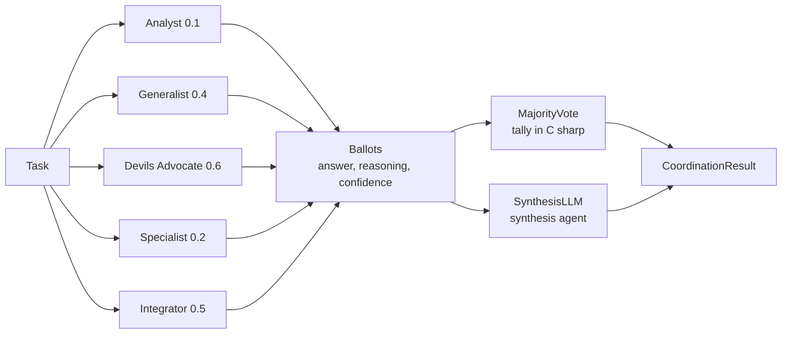

---
{
  "title": "Voting",
  "summary": "Ask several deliberately different agents the same question, then combine their answers into one.",
  "category": "Reasoning & generation",
  "projects": [
    { "flavor": "AgentFramework", "path": "Voting.AgentFramework" },
    { "flavor": "SemanticKernel", "path": "Voting.SemanticKernel" }
  ]
}
---

## What it is

Run the same task through a pool of agents that differ in **persona and temperature**, collect
their answers as ballots, and derive one result. Diversity is the whole point: five identical
agents produce correlated answers, so agreement between them means nothing. Five differently
primed agents that still converge give you a real confidence signal — and when they split, that
disagreement is itself the useful output.

How the ballots become an answer depends on the task. A categorical question can be tallied.
An open-ended one cannot, so a synthesis agent reads all responses and writes the final answer.

## When to use it

- High-stakes calls where a single wrong answer is expensive and you want a disagreement alarm.
- Classification or extraction with a small answer space, where a tally is meaningful.
- Open-ended analysis, using synthesis instead of a tally, to widen coverage of angles.

Skip it for anything latency- or cost-sensitive: this is N+1 model calls for one answer. Skip it
too when the failure mode is *shared* — if every agent is the same model with the same blind
spot, they will agree confidently and be wrong together.

## How the demo works

Both flavors define five voters — Analyst 0.1, Generalist 0.4, Devil's Advocate 0.6, Specialist
0.2 and an integrative fifth (`Integrator` in Agent Framework, `Synthesiser` in Semantic Kernel)
at 0.5 — each returning a structured `Vote(Answer, Reasoning, Confidence)`. Two tasks then run
through different consensus modes: *"What is the capital of Australia?"* through
`ConsensusMode.MajorityVote`, and a question about choosing a cloud provider for a production AI
workload through `ConsensusMode.SynthesisLLM`. All five run concurrently under `Task.WhenAll`
with a 60-second `CancellationTokenSource`; a voter that times out is dropped from the tally
rather than blocking it.

A third mode, `ApplyWeightedVote`, weights each ballot by the confidence the voter reported. It
is implemented in both projects but the demo never selects it — switch a call to
`ConsensusMode.WeightedVote` to see it run.

## Key APIs

| Agent Framework | Semantic Kernel |
|---|---|
| `new ChatClientAgent(client, name:, instructions:)` per voter | `AgentConfig` record + one `ChatHistory` per voter |
| `agent.RunAsync<Vote>(task, options:)` | `svc.GetChatMessageContentAsync(history, settings)` |
| `new ChatClientAgentRunOptions(new ChatOptions { Temperature = t })` | `new AzureOpenAIPromptExecutionSettings { Temperature = t }` |
| Structured output via the generic `RunAsync<Vote>` | `ResponseFormat = typeof(Vote)` + `JsonSerializer.Deserialize<Vote>` |
| Synthesis is a named `SynthesisAgent` you can re-point or wrap | Synthesis is another `ChatHistory` against the same service |

The practical difference: Agent Framework makes each voter and the synthesiser a first-class
named entity, so logs and telemetry attribute cleanly and the synthesis step can later be moved
to a stronger model or fronted by middleware. Semantic Kernel keeps them as configuration over
one shared `IChatCompletionService`.

## What to watch in the output

After the `=== Democratic Coordination ===` banner, look for `Running 5 agents in parallel...`,
then one `[Analyst] (0.1°, confidence 0.95): ...`
line per voter — these arrive in completion order, not pool order, which is proof the calls were
concurrent. Then `Votes collected: 5/5`, a `Vote distribution:` block, and a
`=== Result (MajorityVote) ===` summary with `Final answer:`, `Confidence:` and a `Status:` of
`V Unanimous`, `V Majority` or the `! Split` warning. The second task prints
`Synthesis Agent output:` instead of a tally. **SelfConsistency** is the single-agent version of
this idea — same prompt sampled repeatedly — and **Debate** is what you use when you want the
agents to argue rather than vote in isolation.
