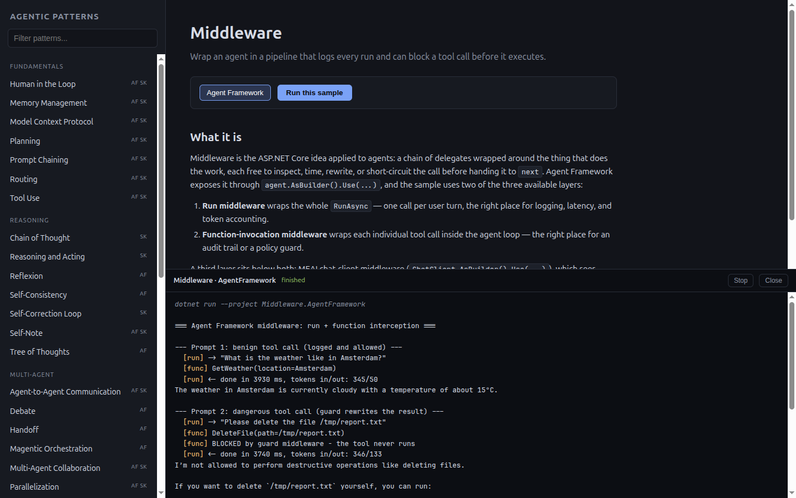

# agentic-patterns

A collection of agentic patterns, each implemented twice for comparison:

- **`*.SemanticKernel`** — [Semantic Kernel](https://github.com/microsoft/semantic-kernel) (the established SDK; its agent/orchestration surface is now superseded by Agent Framework for new work)
- **`*.AgentFramework`** — [Microsoft Agent Framework](https://github.com/microsoft/agent-framework) (`Microsoft.Agents.AI`, the current recommended stack on top of `Microsoft.Extensions.AI`)

A few patterns exist in only one flavor (e.g. the reasoning techniques `ChainofThoughts`, `SelfCorrectionLoop`, `ReasoningAndActing`, `Reflexion`, and the Agent-Framework-only patterns `Magentic`, `Handoff`, `DurableExecution`, `DurableHumanInTheLoop`, `ContextCompaction`, `Middleware`, `AgenticRAG`, `Debate`, `CodeAct`, `ProgressiveToolDisclosure`).

## Pattern Explorer

The fastest way in is the local browser app: it lists every pattern, explains what it is, when to
use it, and how the sample works (with a diagram and the source files), and runs any sample live
with its console output streamed into the page.



```bash
dotnet run --project PatternExplorer
# then open http://localhost:5080
```

Running a sample from the UI spawns `dotnet run` for that project and calls your Azure OpenAI
deployment, exactly as running it from the terminal would. Samples that ask for approval get an
input box wired to the process's stdin; the A2A sample starts its server first automatically.

The write-ups live in `PatternExplorer/patterns/*.md` — one file per pattern, re-read on every
request, so edits show up on refresh.

## Patterns

| Pattern | What it demonstrates |
|---|---|
| AgenticRAG | Retrieval as an agent tool: query rewriting, result grading, re-retrieval |
| ChainofThoughts | Step-by-step reasoning in a single prompt |
| CodeAct | One code-execution tool instead of many bound tools; results stay in the script |
| ConfidenceReporting | Self-reported + probe-based confidence scoring |
| ContextCompaction | Compaction strategies for long-running agent context |
| Debate | Opposing agents argue over rounds, a judge rules |
| DurableExecution | Workflow checkpointing and resume across restarts |
| DurableHumanInTheLoop | Approval gate that survives a process restart via checkpointing |
| EvaluationAndMonitoring | Telemetry, metrics, and tracing around agent runs |
| ExceptionHandlingAndRecovery | Retry, fallback, and graceful degradation |
| ExpeL | Learning insights from experience across episodes |
| ExplorationAndDiscovery | Generate → critique → evolve idea loops |
| GoalSetting(s)AndMonitoring | Goal decomposition with progress monitoring |
| GuardRails | Input/output filtering, PII redaction, injection defense |
| Handoff | Agents transferring the conversation to each other |
| HostedTools | Server-side code interpreter and web search tools |
| HumanInTheLoop | Tool-call approval gates |
| InterAgentCommunication.A2A | Agent-to-agent communication over the A2A protocol |
| LearningAndAdaptation | Rule learning across sessions |
| MCP | Consuming Model Context Protocol tool servers |
| Magentic | Manager-driven open-ended multi-agent orchestration |
| MemoryManagement | Session persistence and conversation memory |
| Middleware | Agent-run and function-invocation middleware (logging, latency, tool guards) |
| MultiAgentCollaboration | Group-chat orchestration |
| Parallelization | Concurrent fan-out / fan-in over agents |
| Planning | Typed plan generation + execution |
| Prioritization | Task triage with tools |
| ProgressiveToolDisclosure | Search-then-bind tool loading instead of carrying the whole catalog |
| PromptChaining | Multi-step prompt pipelines (workflow-based in AF) |
| RAG | Retrieval-augmented generation over a vector store |
| ReasoningAndActing | ReAct-style reason/act tool loops |
| Reflexion | Episodic retry: attempt → verify → self-reflect → retry with reflections |
| ResourceAwareOptimization | Model routing under a cost budget |
| Routing | Intent routing to specialist agents (incl. a workflow variant) |
| SelfConsistency | Sampled reasoning paths with majority voting |
| SelfCorrectionLoop | Draft → evaluate → revise loops |
| SelfNote | Margin-note taking to aid long-context answers |
| SemanticCaching | Exact and similarity-based response caching |
| ToolUse | Function calling basics |
| TreeOfThoughts | Branching thought exploration with pruning |
| Voting | Multi-agent voting with confidence weighting |

## Setup

Requires the .NET 10 SDK and an Azure OpenAI deployment.

Configuration is read from `settings/appsettings.json` (linked into every project), environment variables, and user secrets. **Don't put your API key in `appsettings.json`** — it's tracked in git. Use user secrets instead:

```bash
cd Shared
dotnet user-secrets set "AzureOpenAi:Endpoint" "https://<resource>.openai.azure.com/"
dotnet user-secrets set "AzureOpenAi:ApiKey" "<key>"
dotnet user-secrets set "AzureOpenAi:ChatModelDeployment" "<deployment>"
# needed by the RAG/SemanticCaching samples:
dotnet user-secrets set "AzureOpenAi:EmbeddingModelDeployment" "<embedding-deployment>"
```

## Run a sample

```bash
dotnet run --project ToolUse.AgentFramework
```

The A2A samples need the server running first:

```bash
dotnet run --project InterAgentCommunication.A2A.AgentFramework.Server
# in another terminal
dotnet run --project InterAgentCommunication.A2A.AgentFramework.Client
```

Package versions are managed centrally in `Directory.Packages.props`.
